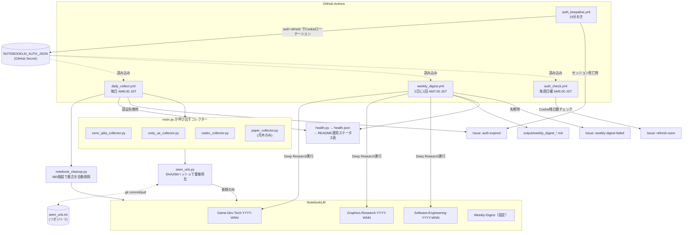
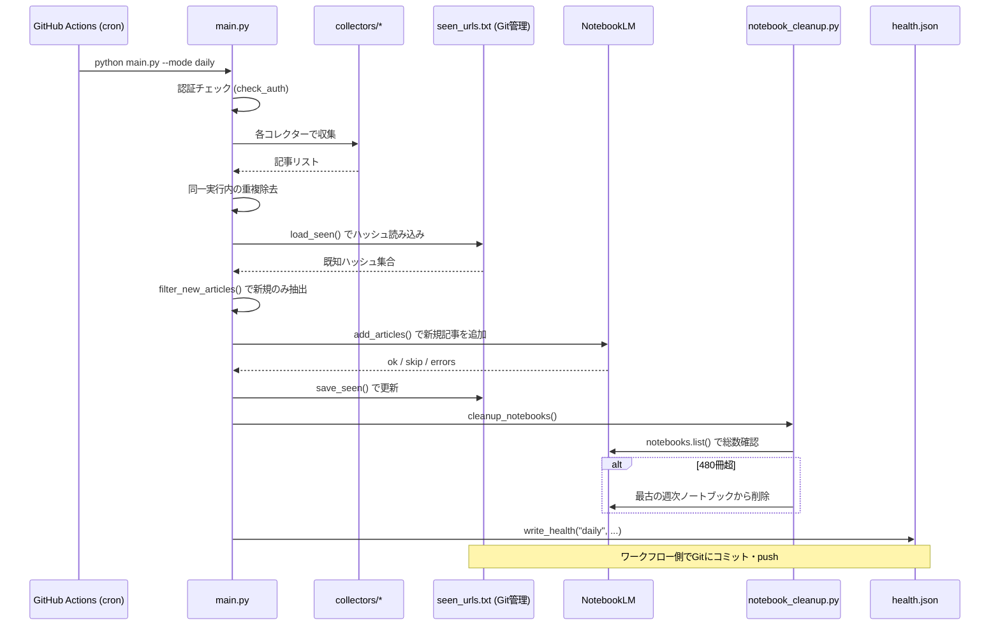
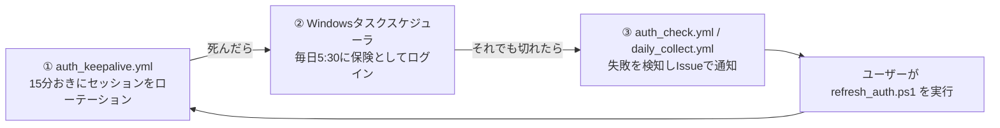
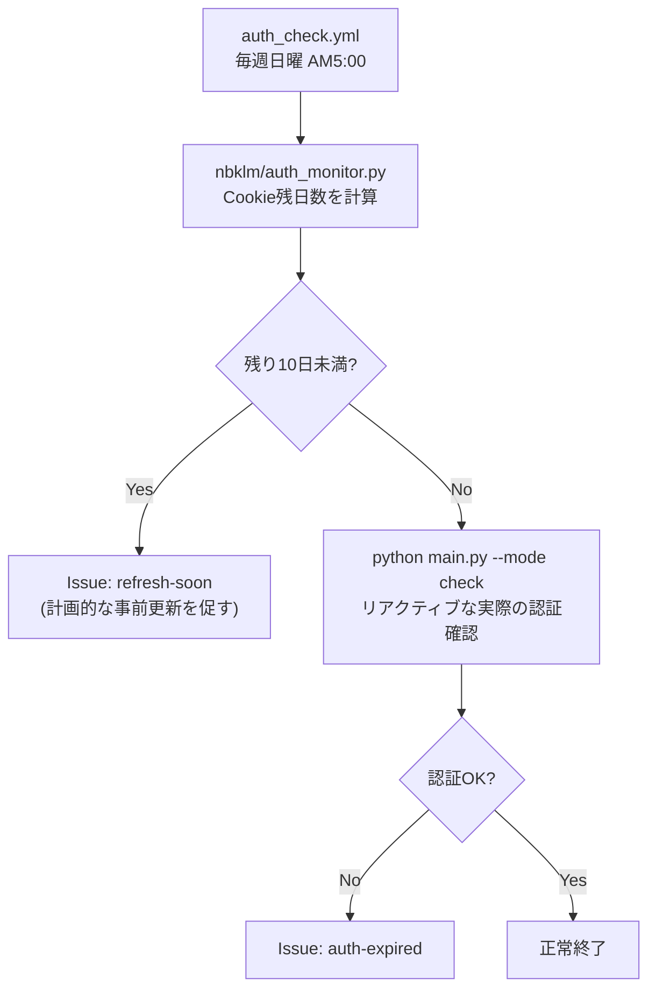
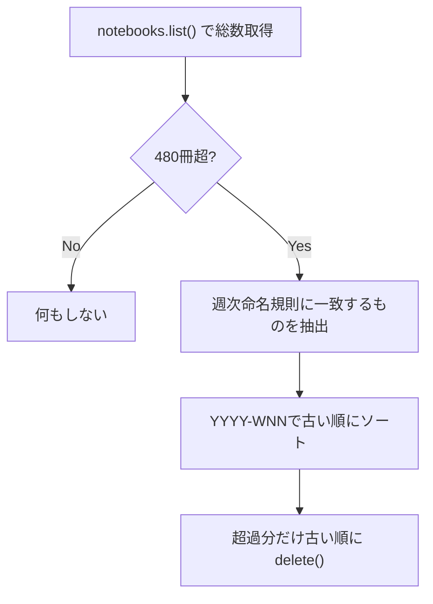
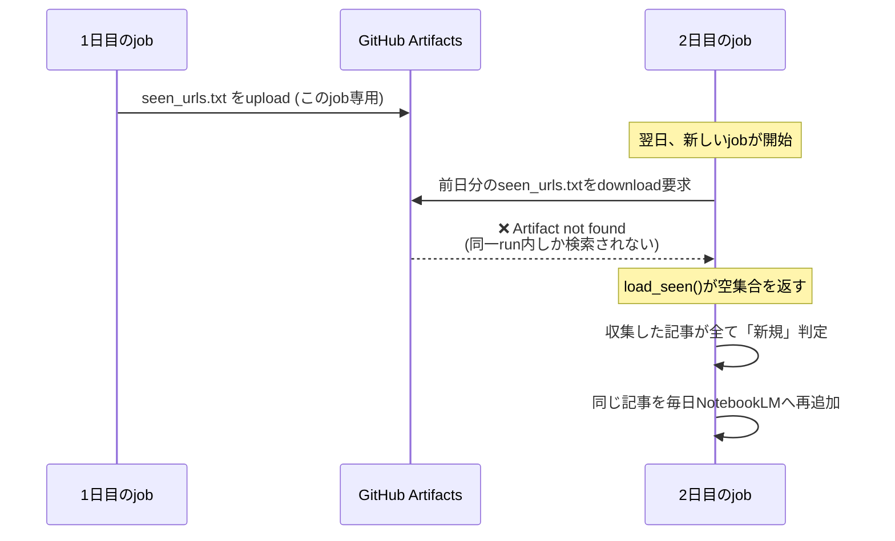

# research-collector ドキュメント

> 作成日: 2026-05-09 / 最終更新: 2026-07-11
> 対象リポジトリ: `manato1201/Research-Collector`
> 作成者: 松浦真聖 (TK230178)

---

## 目次

1. [システム概要](#1-システム概要)
2. [アーキテクチャ全体図](#2-アーキテクチャ全体図)
3. [認証の仕組み](#3-認証の仕組み)
4. [収集ソース一覧](#4-収集ソース一覧)
5. [NotebookLM ノートブック設計](#5-notebooklm-ノートブック設計)
6. [セットアップ手順](#6-セットアップ手順)
7. [ファイル構成](#7-ファイル構成)
8. [運用マニュアル](#8-運用マニュアル)
9. [インシデント事例: 重複除去が機能しなかった問題](#9-インシデント事例-重複除去が機能しなかった問題)
10. [トラブルシューティング](#10-トラブルシューティング)
11. [付録](#11-付録)

---

## 1. システム概要

### 目的

卒業研究・ゲーム開発・技術学習に必要な情報（技術記事・CEDEC資料・論文）を自動収集し、NotebookLMに蓄積することで、AI検索・ポッドキャスト生成・レポート生成を活用できる知識ベースを構築する。**人手の介入なしに継続運用できること**を目標にしている。

### 主な機能

| 機能 | 内容 |
|---|---|
| 毎日自動収集 | Zenn/Qiita/Unity/UE/CEDECの新着記事をRSS経由で収集 |
| 週2回論文収集 | arXiv・Semantic Scholarから関連論文を収集（月・木） |
| 重複チェック | 収集済みURLをハッシュ管理し、Gitへ永続化して再追加を防止 |
| NotebookLM自動追加 | 週次ノートブックへ自動振り分け・追加 |
| レポート生成 | Deep Researchで調査レポートを自動生成（2日に1回） |
| 認証の無人維持 | セッションCookieを15分おきに自動ローテーション |
| ノートブック容量管理 | 上限に近づいたら古いノートブックを自動削除 |
| 障害の可視化 | 失敗時にGitHub Issueで通知、復旧時に自動クローズ |

### 技術スタック

| 要素 | 技術 |
|---|---|
| 実行環境 | GitHub Actions（Ubuntu Latest） |
| 言語 | Python 3.11 |
| NotebookLM操作 | notebooklm-py 0.7.3（非公式APIライブラリ） |
| RSS収集 | feedparser |
| スケジューラ | GitHub Actions cron |
| 認証管理 | GitHub Secrets（`NOTEBOOKLM_AUTH_JSON`、`GH_PAT_SECRETS_WRITE`） |

---

## 2. アーキテクチャ全体図



### データフロー（daily_collect 実行時）



---

## 3. 認証の仕組み

NotebookLMの認証Cookieには、性質の異なる2つの失効パターンがある。

| Cookie | 実際の有効期間 | 失効の性質 |
|---|---|---|
| `SID`（メインの認証情報） | 数百日単位 | 自然にはほぼ失効しない |
| `__Secure-1PSIDTS`（セッション追跡用） | **15〜20分** | Google側の設計上、定期的なローテーションが必須 |

これは2026-07-04の調査で判明した。当初は「Cookieが自然に失効する」という前提でPhase 1（事前検知）のみを実装したが、実機検証で「ログインから約18時間で認証切れ」が再現したため、`__Secure-1PSIDTS`の短命さが真因と特定した（詳細は [9. インシデント事例](#9-インシデント事例-重複除去が機能しなかった問題) の前段でも触れる関連調査を参照）。

### 3.1 3層構造の防御



- **① auth_keepalive.yml**（`.github/workflows/auth_keepalive.yml`）: `notebooklm auth refresh` でセッションを軽量にローテーションし、`NOTEBOOKLM_AUTH_JSON` Secretへ書き戻す。新規ログインを伴わないためBot検知リスクが低い。
  - ⚠️ **既知の制約**: GitHub Actionsは15分間隔のような高頻度cronを負荷状況次第で大幅に遅延させる（実測で1〜2.5時間の遅延を確認）。そのため単独では100%の信頼性は無い。
- **② Windowsタスクスケジューラ**: 毎日AM5:30に`refresh_auth.ps1`を実行する保険。①が機能しなかった日でもここで復旧する。
- **③ Issue通知**: `auth_keepalive.yml` / `daily_collect.yml` / `weekly_digest.yml` / `auth_check.yml` のいずれかで認証失敗を検知したら `auth-expired` ラベルでIssueを自動作成する。`refresh_auth.ps1`成功時に自動クローズされる。

### 3.2 Cookie残日数の事前検知（Phase 1）

`nbklm/auth_monitor.py` が `notebooklm.auth.MINIMUM_REQUIRED_COOKIES`（`SID`, `__Secure-1PSIDTS`）の`expires`最小値を計算する。ただし `__Secure-1PSIDTS` の`expires`フィールドは実際のサーバー側検証タイミング（15〜20分）を反映していないため、この事前検知は主に **SIDファミリーの自然失効** を捉えるためのものであり、PSIDTSの短命さ自体はauth_keepaliveで別途対処している。



---

## 4. 収集ソース一覧

### Zenn（タグ別RSS）

| タグ | URL |
|---|---|
| unity | `https://zenn.dev/topics/unity/feed` |
| unrealengine | `https://zenn.dev/topics/unrealengine/feed` |
| directx | `https://zenn.dev/topics/directx/feed` |
| hlsl | `https://zenn.dev/topics/hlsl/feed` |
| gamedev | `https://zenn.dev/topics/gamedev/feed` |
| houdini | `https://zenn.dev/topics/houdini/feed` |

### Qiita（タグ別RSS）

| タグ | URL |
|---|---|
| unity | `https://qiita.com/tags/unity/feed` |
| unrealengine | `https://qiita.com/tags/unrealengine/feed` |
| directx12 | `https://qiita.com/tags/directx12/feed` |
| hlsl | `https://qiita.com/tags/hlsl/feed` |
| gamedev | `https://qiita.com/tags/gamedev/feed` |

### Unity / Unreal Engine 公式

| ソース | URL |
|---|---|
| Unity Blog | `https://blog.unity.com/feed` |
| Unity Releases | `https://unity.com/releases/lts-vs-tech-stream/feed` |
| UE Blog | `https://www.unrealengine.com/en-US/rss` |

> ⚠️ **UE Forum**（`forums.unrealengine.com/latest.rss`）はBot弾きで恒常的に失敗していたため2026-07-03に削除済み。

### CEDEC

| ソース | 内容 |
|---|---|
| CEDiL | `https://cedil.cesa.or.jp/` のトップページから新着セッションタイトル＋URLを収集（ログイン不要・タイトルのみ） |
| CEDEC YouTube | チャンネルID `UCmHaPXvwn9_4pMNAV6ewgoA` のRSS |

### 論文（月・木のみ実行）

**arXiv 検索クエリ（8件・安定して動作）**
- retrieval augmented generation tutorial generation / LLM step by step instruction generation / conversational agent learning assistance / chatbot technical documentation question answering / video tutorial learning behavior software / developer documentation usage behavior / software documentation maintenance outdated / tutorial obsolescence software update

**Semantic Scholar 検索クエリ（9件）**
- developer documentation usage behavior / video tutorial software learning / how developers learn new tools / tutorial maintenance technical debt / software documentation outdated obsolete / RAG retrieval augmented generation documentation / LLM tutorial generation step by step / DCC tool learning curve creative software / Houdini procedural generation learning

> ⚠️ **既知の問題**: Semantic Scholar APIは無料枠のレート制限が厳しく、9クエリ中6〜7クエリが`HTTP 429`で失敗することが多い（3回リトライしても解消しないケースが大半）。arXivは安定して23件前後を安定収集できている。致命的ではないが収集件数が目減りする。詳細は [10. トラブルシューティング](#10-トラブルシューティング) 参照。

---

## 5. NotebookLM ノートブック設計

### 週次ノートブック（自動作成）

ISO週番号ベースで毎週自動的に新しいノートブックが作成される。

| カテゴリ | ノートブック名の例 | 格納ソース |
|---|---|---|
| Game-Dev-Tech | `Game-Dev-Tech-2026-W28` | Zenn/Qiita/Unity/UE |
| Graphics-Research | `Graphics-Research-2026-W28` | Unity/UE/CEDEC |
| Software-Engineering | `Software-Engineering-2026-W28` | CEDEC/論文 |

### 固定ノートブック

| ノートブック名 | 用途 |
|---|---|
| Weekly-Digest | レポート生成対象（`NOTEBOOKLM_WEEKLY_DIGEST_ID` Secretで指定） |

### ソース振り分けルール

| source_type | Game-Dev-Tech | Graphics-Research | Software-Engineering |
|---|---|---|---|
| zenn / qiita | ✅ | | |
| unity / unreal | ✅ | ✅ | |
| cedec / gdc | | ✅ | ✅ |
| paper / arxiv | | | ✅ |

### 容量管理

| 指標 | 数値 |
|---|---|
| 1ノートブックのソース上限 | 300件 |
| ノートブック総数上限（Plusプラン） | 500冊 |
| **自動削除の閾値** | **480冊**（`nbklm/notebook_cleanup.py`の`MAX_NOTEBOOKS`） |

`daily_collect`実行のたびに`nbklm/notebook_cleanup.py`が総ノートブック数を確認し、480冊を超えていたら週次命名規則（`...-YYYY-WNN`）に一致する最も古いノートブックから順に削除する。`Weekly-Digest`等の固定名ノートブックは削除対象から除外される。



個別ノートブックが300件の上限に達した場合は `notebooklm source clean` で重複ソースを削除することで空きを作れる（2026-07-11のインシデントで実施、詳細は次章）。

---

## 6. セットアップ手順

> 2026-07-11時点の最新手順。WSL2は不要（Windows上の`notebooklm-py`で取得したCookieはGitHub Actions（Linux）でもそのまま使える）。

### 前提条件

- Python 3.11 以上（Windows）
- GitHubアカウント（privateリポジトリ推奨）
- Googleアカウント（NotebookLM Plus推奨）
- GitHub CLI（`gh`）
- Anthropic APIキー（現状コード内では未使用。将来の拡張用に予約）

### Step 1: 依存ライブラリのインストール

```powershell
pip install feedparser requests python-dotenv
pip install "notebooklm-py[browser]==0.7.3"
playwright install chromium
```

### Step 2: NotebookLMへの初回ログイン

```powershell
notebooklm login
notebooklm create "Weekly-Digest"
# 表示されたIDをメモ
```

ログイン成功で `~/.notebooklm/profiles/default/storage_state.json` が生成される（0.7.3からのプロファイル形式パス）。

### Step 3: GitHub Secretsの登録

```powershell
$json = (Get-Content "$env:USERPROFILE\.notebooklm\profiles\default\storage_state.json" -Raw | ConvertFrom-Json | ConvertTo-Json -Compress -Depth 10)
$json | gh secret set NOTEBOOKLM_AUTH_JSON --repo あなたのユーザー名/リポジトリ名
```

| Secret名 | 内容 |
|---|---|
| `NOTEBOOKLM_AUTH_JSON` | 上記コマンドで登録 |
| `NOTEBOOKLM_WEEKLY_DIGEST_ID` | Step 2でメモしたID |
| `ANTHROPIC_API_KEY` | https://console.anthropic.com で取得（現状未使用） |
| `GH_PAT_SECRETS_WRITE` | Secrets書き込み権限のみのFine-grained PAT（下記参照） |

**`GH_PAT_SECRETS_WRITE` の作成手順**（`auth_keepalive.yml`がSecretを自動更新するために必要。`GITHUB_TOKEN`にはSecrets書き込み権限がないため専用PATが必要）:

1. https://github.com/settings/personal-access-tokens/new を開く
2. Repository access → 対象リポジトリのみ選択
3. Permissions → Repository permissions → **Secrets: Read and write**
4. 発行したトークンを登録:
   ```powershell
   Get-Clipboard | gh secret set GH_PAT_SECRETS_WRITE --repo あなたのユーザー名/リポジトリ名
   ```
   （対話プロンプトへの貼り付けは失敗することがあるため、クリップボードからパイプで渡す方式を推奨）

### Step 4: ラベル作成・Workflow permissions

```
リポジトリの /labels → New label → auth-expired（色は任意）
リポジトリの /labels → New label → refresh-soon
リポジトリの /labels → New label → weekly-digest-failed

Settings → Actions → General → Workflow permissions
→ Read and write permissions → Save
```

### Step 5: ローカル動作確認

```powershell
python main.py --mode check   # 認証確認
python main.py --mode daily   # 収集テスト
```

### Step 6: GitHubにpushして自動実行を有効化

```powershell
git add .
git commit -m "initial setup"
git push origin main
```

Actionsタブ → `Daily Research Collect` → `Run workflow` で手動実行してテスト。

### Step 7: タスクスケジューラ登録（保険の認証更新）

```powershell
.\register_task.ps1
```

毎日AM5:30に`refresh_auth.ps1`を実行する予約タスクを登録する。ブラウザでの再ログインが必要な場合に備えた保険であり、auth_keepaliveが正常動作していれば通常は不要。

---

## 7. ファイル構成

```
Research-Collector/
├── .github/workflows/
│   ├── daily_collect.yml      # 毎日 AM 6:00 JST
│   ├── weekly_digest.yml      # 2日に1回 AM 7:00 JST
│   ├── auth_check.yml         # 毎週日曜 AM 5:00 JST（Cookie残日数事前検知）
│   └── auth_keepalive.yml     # 15分おき（セッションローテーション）
├── collectors/
│   ├── retry.py                # 指数バックオフ付きリトライの共通デコレータ
│   ├── zenn_qiita_collector.py
│   ├── unity_ue_collector.py
│   ├── cedec_collector.py
│   └── paper_collector.py
├── nbklm/
│   ├── __init__.py
│   ├── client.py                # notebooklm-py ラッパー
│   ├── notebook_ids.py          # ノートブックID・振り分けルール定義
│   ├── notebook_cleanup.py      # 容量上限に近づいたら古いノートブックを自動削除
│   ├── auth_monitor.py          # Cookie残日数の事前検知
│   └── seen_urls.py             # 収集済みURL重複チェック管理（Git管理）
├── scripts/
│   └── update_readme_health.py  # health.json → README運用ステータス表を更新
├── main.py                      # メインエントリーポイント
├── health.py                    # 実行結果を health.json に記録
├── requirements.txt
├── seen_urls.txt                 # 収集済みURLハッシュ（Gitで永続化）
├── health.json                   # 直近の実行結果（Gitで永続化）
├── refresh_auth.ps1              # 認証更新スクリプト（PowerShell）
├── run_auth_refresh.bat          # タスクスケジューラ起動用バッチ
├── register_task.ps1             # タスクスケジューラ登録スクリプト
├── IMPROVEMENT_PLAN.md           # 完全自動化に向けた改善計画・実施記録
├── DOCUMENT.md                   # このドキュメント
└── HANDSON.md                    # ハンズオン資料
```

---

## 8. 運用マニュアル

### 通常運用（何もしなくてOK）

| タイミング | 内容 | 実行環境 |
|---|---|---|
| 15分おき | セッションCookieのキープアライブ | GitHub Actions |
| 毎日 AM 5:30 JST | 認証更新（保険） | Windowsタスクスケジューラ |
| 毎日 AM 6:00 JST | デイリー収集 → NotebookLMへ追加 | GitHub Actions |
| 2日に1回 AM 7:00 JST | レポート生成（Deep Research） | GitHub Actions |
| 毎週日曜 AM 5:00 JST | Cookie残日数の事前検知 | GitHub Actions |

### NotebookLMの活用方法

```
① 週次ノートブック（例: Game-Dev-Tech-2026-W28）を開く
  → その週に収集された記事が自動追加されている

② チャットで質問する
  → 「今週のUnityの注目アップデートを教えて」

③ Audio Overviewを生成する
  → 通勤中に今週の技術トレンドを耳で聞ける

④ レポートを確認する
  → 2日に1回自動生成されたMarkdownをActionsのArtifactsで確認
```

### 認証が切れた場合

`refresh-soon` または `auth-expired` ラベルのIssueが作成されたら、以下を実行する。

```powershell
cd C:\Users\matuu\Desktop\GameDevelopment\Research-Collector
.\refresh_auth.ps1
```

成功すると自動でGitHub Secretが更新され、該当Issueもクローズされる。

### seen_urls.txt のリセット方法

古いURLを再収集したい場合（ノートブックを作り直した時など）にリセットできる。

```powershell
Remove-Item seen_urls.txt
git add seen_urls.txt
git commit -m "chore: reset seen_urls.txt"
git push
```

### ノートブックが容量上限（300件）に達した場合

```powershell
notebooklm source clean -n <notebook_id> --dry-run   # 影響確認
notebooklm source clean -n <notebook_id> -y          # 重複ソースを実際に削除
```

---

## 9. インシデント事例: 重複除去が機能しなかった問題

**発生**: 2026-07-11、ユーザーから「収集はできているがNotebookLMに追加されていない」との報告。

**根本原因**: `daily_collect.yml`が`actions/download-artifact@v4`で前日の`seen_urls.txt`を取得していたが、このアクションはデフォルトで**同一ワークフロー実行内**のアーティファクトしか探せない仕様のため、`Artifact not found for name: seen-urls`のエラーが**毎回**発生し、重複除去が実質的に一度も機能していなかった。



**波及した実害**: 直近5週分・17冊のノートブックが同じ記事の重複で300件の上限に達し、それ以降の新規追加が全て`RPCError rpc_code=9`（FAILED_PRECONDITION）で失敗する状態になっていた。

**対処**:
1. `seen_urls.txt`の永続化方式を、壊れていたアーティファクト方式から`health.json`と同じ**Gitコミット方式**に変更（`.gitignore`からも除外）
2. 満杯だった17冊のノートブックを`notebooklm source clean -y`で重複ソースを削除しクリーンアップ
3. 実機で2回連続実行し、「短時間では新規0件」「時間を空けると正しく新規検知」の両方を確認して修正を検証

**教訓**: `actions/download-artifact@v4`はワークフロー横断でのデータ永続化には不向き。cross-run参照が必要な場合はGitへのコミット、またはリポジトリ変数/Secretsを使う方が確実。

---

## 10. トラブルシューティング

### Q: GitHub Actionsで認証エラーが出る

```
auth FAILED: Authentication expired or invalid
```

**対処:** `refresh_soon`/`auth-expired`ラベルのIssueが立っているはずなので、`.\refresh_auth.ps1`を実行。

### Q: `All articles already seen. Nothing to add.` と表示される

収集した記事が全て`seen_urls.txt`に記録済みのため正常動作。新着記事がない場合は何も追加されない。

### Q: NotebookLMへの追加でerrorが大量に出る（`RPCError rpc_code=9`）

該当ノートブックが300件の上限に達している可能性が高い。[8. 運用マニュアル](#8-運用マニュアル)の手順で`notebooklm source clean`を実行する。

### Q: `auth_keepalive.yml`が頻繁に失敗する

GitHub Actionsは15分間隔のような高頻度cronを負荷状況次第で大幅に遅延させる仕様上の制約があり、完全に解消することはできない。`Windowsタスクスケジューラ`による毎日の保険的な再ログインと、失敗時のIssue通知（`auth-expired`ラベル）で実運用上はカバーしている。

### Q: Semantic Scholar収集がほぼ失敗する（`HTTP Error 429`）

無料枠のレート制限によるもの。arXivは安定して動作するため致命的ではないが、`collectors/paper_collector.py`の`collect_semantic_scholar`のリクエスト間隔（`time.sleep(1)`）を伸ばすと改善する可能性がある。

### Q: GitHub Actionsのスケジュール実行が止まった

GitHubはリポジトリに60日間アクティビティがないとcronを停止する。`health.json`/`seen_urls.txt`の自動コミットがアクティビティとして認識されるため通常は止まらない。

---

## 11. 付録

### GitHub Secrets 一覧

| Secret名 | 説明 | 取得方法 |
|---|---|---|
| `NOTEBOOKLM_AUTH_JSON` | NotebookLM認証JSON | `notebooklm login`後に取得 |
| `NOTEBOOKLM_WEEKLY_DIGEST_ID` | Weekly-DigestノートブックID | `notebooklm create "Weekly-Digest"` |
| `GH_PAT_SECRETS_WRITE` | Secrets書き込み専用PAT | https://github.com/settings/personal-access-tokens/new |
| `ANTHROPIC_API_KEY` | Anthropic APIキー（現状未使用） | https://console.anthropic.com |
| `NOTION_TOKEN` | Notion Integration Token（`notion/client.py`は未実装のため現状無効） | https://www.notion.so/profile/integrations |

### 実行コマンド早見表

```powershell
# 認証確認
python main.py --mode check

# デイリー収集（手動実行）
python main.py --mode daily

# レポート生成（手動実行）
python main.py --mode weekly

# notebooklm CLI
notebooklm list                       # ノートブック一覧
notebooklm login                      # 再ログイン
notebooklm auth refresh               # セッションローテーション（1回のみ）
notebooklm auth check --test          # 認証の詳細診断
notebooklm doctor                     # プロファイル・認証状態の総合チェック
notebooklm source clean -n <id> -y    # 重複ソースの削除

# GitHub Actions手動実行
gh workflow run daily_collect.yml
gh workflow run weekly_digest.yml
gh workflow run auth_check.yml
gh workflow run auth_keepalive.yml
```

### 変更履歴（サマリ）

| 日付 | 内容 |
|---|---|
| 2026-05-09 | 初版作成 |
| 2026-07-03 | Cookie残日数の事前検知（Phase 1）を追加 |
| 2026-07-04 | notebooklm-py 0.7.3へアップグレード、auth_keepalive.yml追加（Phase 2）、リトライ・失敗通知・ヘルスダッシュボード追加（Phase 4） |
| 2026-07-11 | ノートブック自動削除・レポート頻度変更（2日に1回）を追加。seen_urls.txt永続化バグを修正し、満杯だったノートブックをクリーンアップ。auth_keepalive失敗時のIssue通知を追加 |
