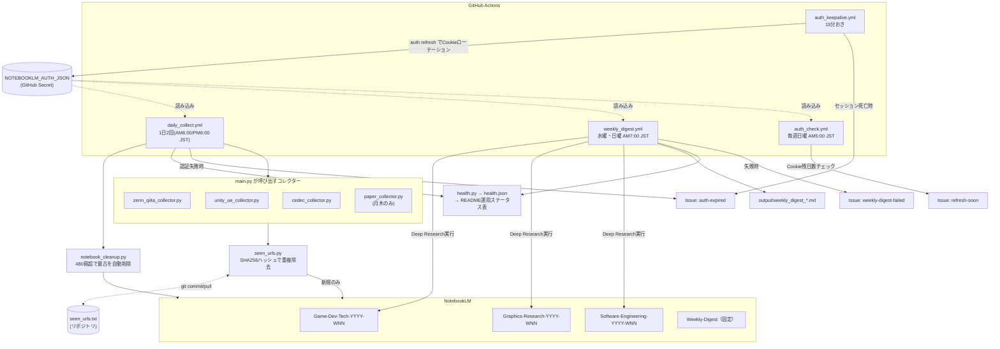
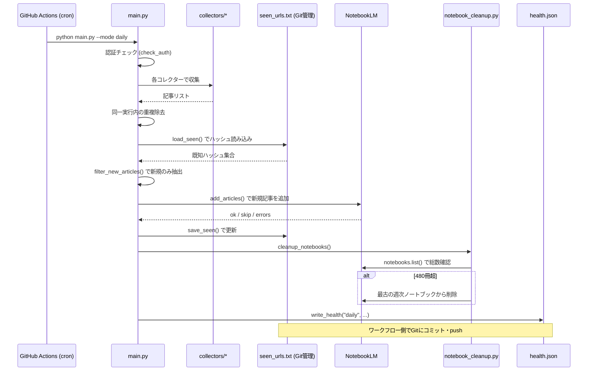
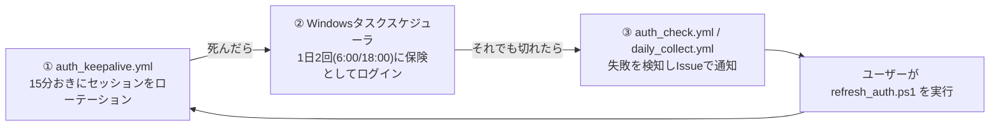
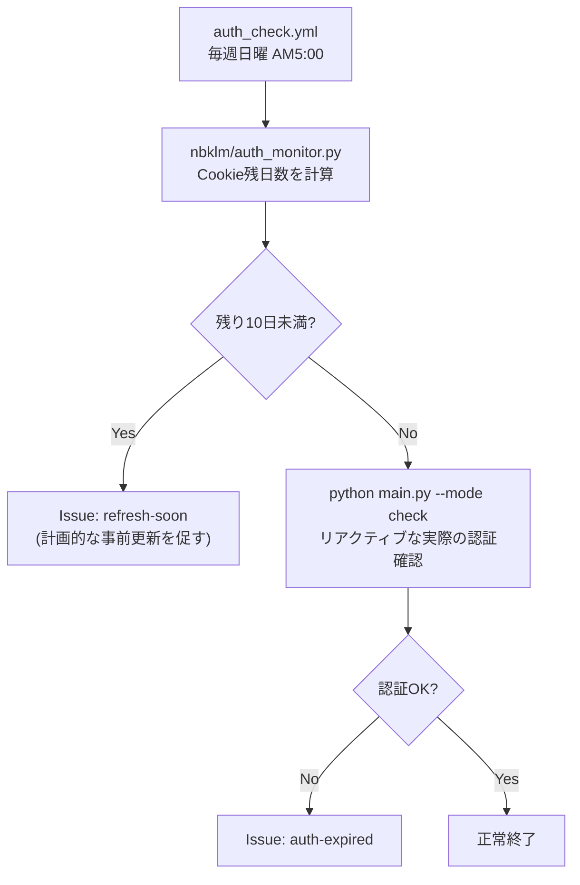
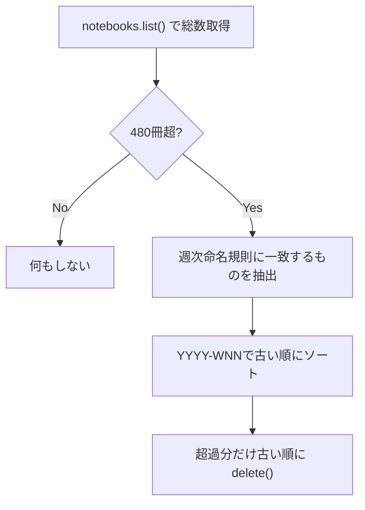
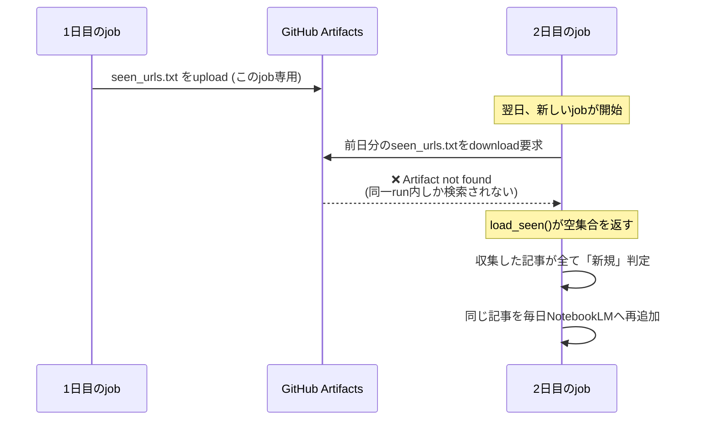
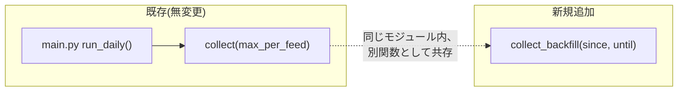
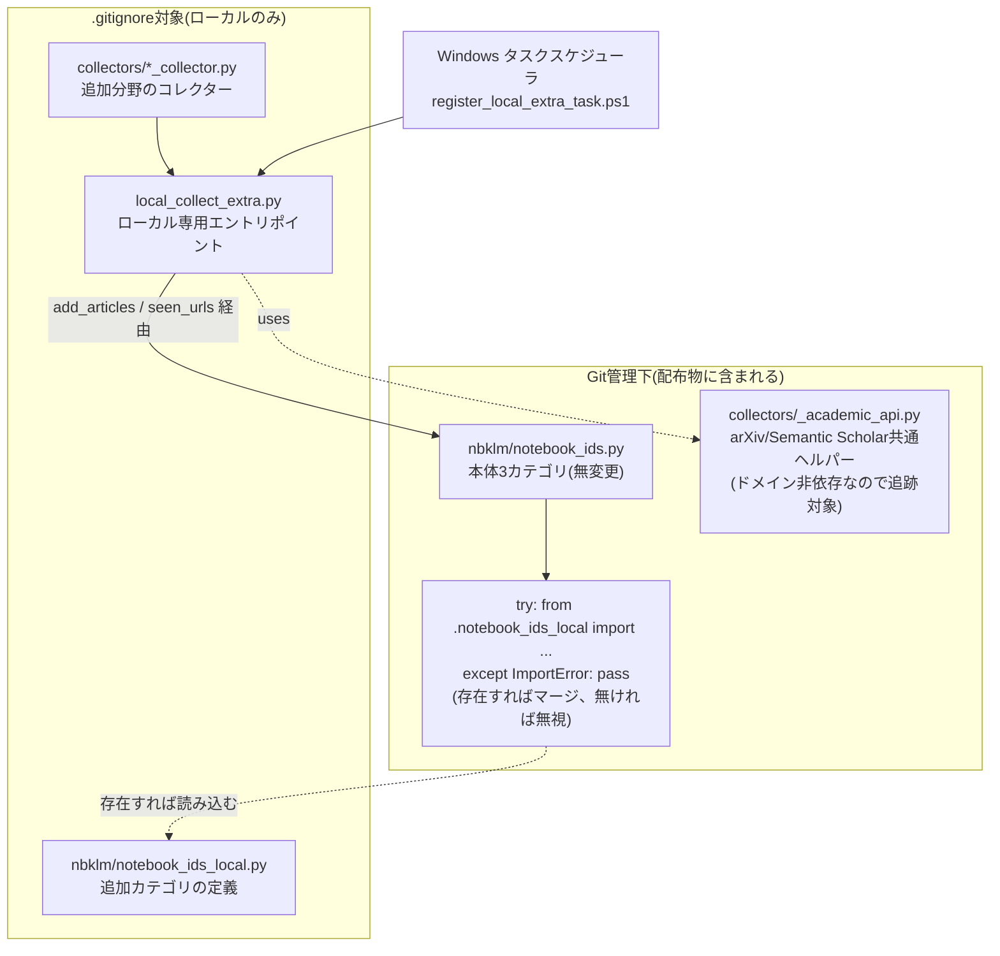
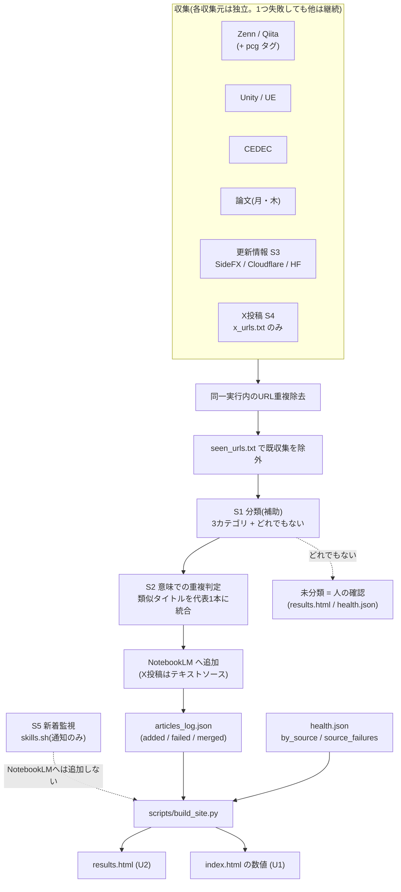

# research-collector ドキュメント

> 作成日: 2026-05-09 / 最終更新: 2026-10-10
> 対象リポジトリ: `manato1201/Research-Collector`
> 作成者: 松浦真聖 (TK230178)

---

## 目次

1. [システム概要](#1-システム概要)
2. [アーキテクチャ全体図](#2-アーキテクチャ全体図)
3. [認証の仕組み](#3-認証の仕組み)
4. [収集ソース一覧](#4-収集ソース一覧)
5. [NotebookLM ノートブック設計](#5-notebooklm-ノートブック設計)
6. [セットアップ手順](#6-セットアップ手順)
7. [ファイル構成](#7-ファイル構成)
8. [運用マニュアル](#8-運用マニュアル)
9. [インシデント事例: 重複除去が機能しなかった問題](#9-インシデント事例-重複除去が機能しなかった問題)
10. [トラブルシューティング](#10-トラブルシューティング)
11. [バックフィル機構とローカル限定拡張](#11-バックフィル機構とローカル限定拡張)
12. [2026-10の改善 収集の拡張と画面](#12-2026-10の改善-収集の拡張と画面)
13. [付録](#13-付録)

---

## 1. システム概要

### 目的

卒業研究・ゲーム開発・技術学習に必要な情報（技術記事・CEDEC資料・論文）を自動収集し、NotebookLMに蓄積することで、AI検索・ポッドキャスト生成・レポート生成を活用できる知識ベースを構築する。**人手の介入なしに継続運用できること**を目標にしている。

### 主な機能

| 機能 | 内容 |
|---|---|
| 毎日自動収集 | Zenn/Qiita/Unity/UE/CEDECの新着記事をRSS経由で収集 |
| 週2回論文収集 | arXiv・Semantic Scholarから関連論文を収集（月・木） |
| 重複チェック | 収集済みURLをハッシュ管理し、Gitへ永続化して再追加を防止 |
| NotebookLM自動追加 | 週次ノートブックへ自動振り分け・追加 |
| レポート生成 | Deep Researchで調査レポートを自動生成（水曜・日曜） |
| 認証の無人維持 | セッションCookieを15分おきに自動ローテーション |
| ノートブック容量管理 | 上限に近づいたら古いノートブックを自動削除 |
| 障害の可視化 | 失敗時にGitHub Issueで通知、復旧時に自動クローズ。取得に失敗した収集元は `health.json` と画面に残る(12章) |
| 分類の補助・意味での重複判定 | 記事を3カテゴリに分類し、判断できないものは人の確認に回す。類似タイトルは代表1本に統合(12章) |
| 収集結果ビュー | 集まった記事を期間・カテゴリで絞り込める静的HTML(`results.html`)を収集のたびに自動生成(12章) |

### 技術スタック

| 要素 | 技術 |
|---|---|
| 実行環境 | GitHub Actions（Ubuntu Latest） |
| 言語 | Python 3.11 |
| NotebookLM操作 | notebooklm-py 0.7.3（非公式APIライブラリ） |
| RSS収集 | feedparser |
| スケジューラ | GitHub Actions cron |
| 認証管理 | GitHub Secrets（`NOTEBOOKLM_AUTH_JSON`、`GH_PAT_SECRETS_WRITE`） |

---

## 2. アーキテクチャ全体図


```mermaid
flowchart TB
    subgraph GHA["GitHub Actions"]
        direction TB
        KA["auth_keepalive.yml<br/>15分おき"]
        DC["daily_collect.yml<br/>1日2回(AM6:00/PM6:00 JST)"]
        WD["weekly_digest.yml<br/>水曜・日曜 AM7:00 JST"]
        AC["auth_check.yml<br/>毎週日曜 AM5:00 JST"]
    end

    subgraph Collectors["main.py が呼び出すコレクター"]
        direction TB
        C1["zenn_qiita_collector.py"]
        C2["unity_ue_collector.py"]
        C3["cedec_collector.py"]
        C4["paper_collector.py<br/>(月木のみ)"]
    end

    subgraph NBK["NotebookLM"]
        direction TB
        NB1["Game-Dev-Tech-YYYY-WNN"]
        NB2["Graphics-Research-YYYY-WNN"]
        NB3["Software-Engineering-YYYY-WNN"]
        NB4["Weekly-Digest（固定）"]
    end

    Secret[("NOTEBOOKLM_AUTH_JSON<br/>(GitHub Secret)")]

    KA -- "auth refresh でCookieローテーション" --> Secret
    Secret -. 読み込み .-> DC
    Secret -. 読み込み .-> WD
    Secret -. 読み込み .-> AC

    DC --> Collectors
    Collectors --> Dedup["seen_urls.py<br/>SHA256ハッシュで重複除去"]
    Dedup -- "新規のみ" --> NBK
    Dedup <-. "git commit/pull" .-> Repo[("seen_urls.txt<br/>(リポジトリ)")]

    DC --> Cleanup["notebook_cleanup.py<br/>480冊超で最古を自動削除"]
    Cleanup --> NBK

    WD -- "Deep Research実行" --> NB1 & NB2 & NB3
    WD --> Report["output/weekly_digest_*.md"]

    DC --> Health["health.py → health.json<br/>→ README運用ステータス表"]
    WD --> Health

    AC -- "Cookie残日数チェック" --> Issue1["Issue: refresh-soon"]
    DC -- "認証失敗時" --> Issue2["Issue: auth-expired"]
    KA -- "セッション死亡時" --> Issue2
    WD -- "失敗時" --> Issue3["Issue: weekly-digest-failed"]
```

### データフロー（daily_collect 実行時）


```mermaid
sequenceDiagram
    participant Cron as GitHub Actions (cron)
    participant Main as main.py
    participant Col as collectors/*
    participant Seen as seen_urls.txt (Git管理)
    participant NB as NotebookLM
    participant Clean as notebook_cleanup.py
    participant Health as health.json

    Cron->>Main: python main.py --mode daily
    Main->>Main: 認証チェック (check_auth)
    Main->>Col: 各コレクターで収集
    Col-->>Main: 記事リスト
    Main->>Main: 同一実行内の重複除去
    Main->>Seen: load_seen() でハッシュ読み込み
    Seen-->>Main: 既知ハッシュ集合
    Main->>Main: filter_new_articles() で新規のみ抽出
    Main->>NB: add_articles() で新規記事を追加
    NB-->>Main: ok / skip / errors
    Main->>Seen: save_seen() で更新
    Main->>Clean: cleanup_notebooks()
    Clean->>NB: notebooks.list() で総数確認
    alt 480冊超
        Clean->>NB: 最古の週次ノートブックから削除
    end
    Main->>Health: write_health("daily", ...)
    Note over Seen,Health: ワークフロー側でGitにコミット・push
```

---

## 3. 認証の仕組み

NotebookLMの認証Cookieには、性質の異なる2つの失効パターンがある。

| Cookie | 実際の有効期間 | 失効の性質 |
|---|---|---|
| `SID`（メインの認証情報） | 数百日単位 | 自然にはほぼ失効しない |
| `__Secure-1PSIDTS`（セッション追跡用） | **15〜20分** | Google側の設計上、定期的なローテーションが必須 |

これは2026-07-04の調査で判明した。当初は「Cookieが自然に失効する」という前提でPhase 1（事前検知）のみを実装したが、実機検証で「ログインから約18時間で認証切れ」が再現したため、`__Secure-1PSIDTS`の短命さが真因と特定した（詳細は [9. インシデント事例](#9-インシデント事例-重複除去が機能しなかった問題) の前段でも触れる関連調査を参照）。

### 3.1 3層構造の防御


```mermaid
flowchart LR
    A["① auth_keepalive.yml<br/>15分おきにセッションをローテーション"] -->|"死んだら"| B["② Windowsタスクスケジューラ<br/>1日2回(6:00/18:00)に保険としてログイン"]
    B -->|"それでも切れたら"| C["③ auth_check.yml / daily_collect.yml<br/>失敗を検知しIssueで通知"]
    C --> D["ユーザーが refresh_auth.ps1 を実行"]
    D --> A
```

- **① auth_keepalive.yml**（`.github/workflows/auth_keepalive.yml`）: `notebooklm auth refresh` でセッションを軽量にローテーションし、`NOTEBOOKLM_AUTH_JSON` Secretへ書き戻す。新規ログインを伴わないためBot検知リスクが低い。
  - ⚠️ **既知の制約**: GitHub Actionsは15分間隔のような高頻度cronを負荷状況次第で大幅に遅延させる（実測で1〜2.5時間の遅延を確認）。そのため単独では100%の信頼性は無い。
- **② Windowsタスクスケジューラ**: 1日2回(AM6:00/PM6:00)に`refresh_auth.ps1`を実行する保険。①が機能しなかった日でもここで復旧する。
- **③ Issue通知**: `auth_keepalive.yml` / `daily_collect.yml` / `weekly_digest.yml` / `auth_check.yml` のいずれかで認証失敗を検知したら `auth-expired` ラベルでIssueを自動作成する。`refresh_auth.ps1`成功時に自動クローズされる。

### 3.2 Cookie残日数の事前検知（Phase 1）

`nbklm/auth_monitor.py` が `notebooklm.auth.MINIMUM_REQUIRED_COOKIES`（`SID`, `__Secure-1PSIDTS`）の`expires`最小値を計算する。ただし `__Secure-1PSIDTS` の`expires`フィールドは実際のサーバー側検証タイミング（15〜20分）を反映していないため、この事前検知は主に **SIDファミリーの自然失効** を捉えるためのものであり、PSIDTSの短命さ自体はauth_keepaliveで別途対処している。


```mermaid
flowchart TD
    A["auth_check.yml<br/>毎週日曜 AM5:00"] --> B["nbklm/auth_monitor.py<br/>Cookie残日数を計算"]
    B --> C{"残り10日未満?"}
    C -- Yes --> D["Issue: refresh-soon<br/>(計画的な事前更新を促す)"]
    C -- No --> E["python main.py --mode check<br/>リアクティブな実際の認証確認"]
    E --> F{"認証OK?"}
    F -- No --> G["Issue: auth-expired"]
    F -- Yes --> H["正常終了"]
```

---

## 4. 収集ソース一覧

### Zenn（タグ別RSS）

| タグ | URL |
|---|---|
| unity | `https://zenn.dev/topics/unity/feed` |
| unrealengine | `https://zenn.dev/topics/unrealengine/feed` |
| directx | `https://zenn.dev/topics/directx/feed` |
| hlsl | `https://zenn.dev/topics/hlsl/feed` |
| gamedev | `https://zenn.dev/topics/gamedev/feed` |
| houdini | `https://zenn.dev/topics/houdini/feed` |

### Qiita（タグ別RSS）

| タグ | URL |
|---|---|
| unity | `https://qiita.com/tags/unity/feed` |
| unrealengine | `https://qiita.com/tags/unrealengine/feed` |
| directx12 | `https://qiita.com/tags/directx12/feed` |
| hlsl | `https://qiita.com/tags/hlsl/feed` |
| gamedev | `https://qiita.com/tags/gamedev/feed` |

### Unity / Unreal Engine 公式

| ソース | URL |
|---|---|
| Unity Blog | `https://blog.unity.com/feed` |
| UE Blog | `https://www.unrealengine.com/en-US/rss` |

> ⚠️ **UE Forum**（`forums.unrealengine.com/latest.rss`）はBot弾きで恒常的に失敗していたため2026-07-03に削除済み。
> ⚠️ **Unity Releases**（`unity.com/releases/lts-vs-tech-stream/feed`）は404でRSSとして存在せず、失敗が記録されていなかっただけだったため2026-10-10に削除済み(12.2)。

### 更新情報・その他（2026-10追加。詳細は12章）

| 収集元 | 取得方法 | 追加先 |
|---|---|---|
| SideFX Houdini 変更履歴(バグ修正のみのものは除く) | バージョン別RSS(最新系列を自動選択) | Game-Dev-Tech + Graphics-Research |
| Cloudflare 変更履歴 | RSS | Software-Engineering |
| Hugging Face ブログ(モデルの公開) | RSS | Software-Engineering |
| UE PCG | Zenn / Qiita の `pcg` タグ | Game-Dev-Tech + Graphics-Research |
| X の投稿 | `x_urls.txt` に書いたURLのみ。中継サービス経由で本文を取得 | Software-Engineering |
| skills.sh | 新着の監視のみ(通知。導入・NotebookLMへの追加はしない) | — |

### CEDEC

| ソース | 内容 |
|---|---|
| CEDiL | `https://cedil.cesa.or.jp/` のトップページから新着セッションタイトル＋URLを収集（ログイン不要・タイトルのみ） |
| CEDEC YouTube | チャンネルID `UCmHaPXvwn9_4pMNAV6ewgoA` のRSS |

### 論文（月・木のみ実行）

**arXiv 検索クエリ（8件・安定して動作）**
- retrieval augmented generation tutorial generation / LLM step by step instruction generation / conversational agent learning assistance / chatbot technical documentation question answering / video tutorial learning behavior software / developer documentation usage behavior / software documentation maintenance outdated / tutorial obsolescence software update

**Semantic Scholar 検索クエリ（9件）**
- developer documentation usage behavior / video tutorial software learning / how developers learn new tools / tutorial maintenance technical debt / software documentation outdated obsolete / RAG retrieval augmented generation documentation / LLM tutorial generation step by step / DCC tool learning curve creative software / Houdini procedural generation learning

> ⚠️ **既知の問題**: Semantic Scholar APIは無料枠のレート制限が厳しく、9クエリ中6〜7クエリが`HTTP 429`で失敗することが多い（3回リトライしても解消しないケースが大半）。arXivは安定して23件前後を安定収集できている。致命的ではないが収集件数が目減りする。詳細は [10. トラブルシューティング](#10-トラブルシューティング) 参照。

---

## 5. NotebookLM ノートブック設計

### 週次ノートブック（自動作成）

ISO週番号ベースで毎週自動的に新しいノートブックが作成される。

| カテゴリ | ノートブック名の例 | 格納ソース |
|---|---|---|
| Game-Dev-Tech | `Game-Dev-Tech-2026-W28` | Zenn/Qiita/Unity/UE |
| Graphics-Research | `Graphics-Research-2026-W28` | Unity/UE/CEDEC |
| Software-Engineering | `Software-Engineering-2026-W28` | CEDEC/論文 |

### 固定ノートブック

| ノートブック名 | 用途 |
|---|---|
| Weekly-Digest | レポート生成対象（`NOTEBOOKLM_WEEKLY_DIGEST_ID` Secretで指定） |

### ソース振り分けルール

| source_type | Game-Dev-Tech | Graphics-Research | Software-Engineering |
|---|---|---|---|
| zenn / qiita | ✅ | | |
| unity / unreal | ✅ | ✅ | |
| cedec / gdc | | ✅ | ✅ |
| paper / arxiv | | | ✅ |
| houdini(SideFX変更履歴) | ✅ | ✅ | |
| cloudflare / model / x_post | | | ✅ |

### 容量管理

| 指標 | 数値 |
|---|---|
| 1ノートブックのソース上限 | 300件 |
| ノートブック総数上限（Plusプラン） | 500冊 |
| **自動削除の閾値** | **480冊**（`nbklm/notebook_cleanup.py`の`MAX_NOTEBOOKS`） |

`daily_collect`実行のたびに`nbklm/notebook_cleanup.py`が総ノートブック数を確認し、480冊を超えていたら週次命名規則（`...-YYYY-WNN`）に一致する最も古いノートブックから順に削除する。`Weekly-Digest`等の固定名ノートブックは削除対象から除外される。


```mermaid
flowchart TD
    A["notebooks.list() で総数取得"] --> B{"480冊超?"}
    B -- No --> Z["何もしない"]
    B -- Yes --> C["週次命名規則に一致するものを抽出"]
    C --> D["YYYY-WNNで古い順にソート"]
    D --> E["超過分だけ古い順に delete()"]
```

個別ノートブックが300件の上限に達した場合は `notebooklm source clean` で重複ソースを削除することで空きを作れる（2026-07-11のインシデントで実施、詳細は次章）。

---

## 6. セットアップ手順

> 2026-07-11時点の最新手順。WSL2は不要（Windows上の`notebooklm-py`で取得したCookieはGitHub Actions（Linux）でもそのまま使える）。

### 前提条件

- Python 3.11 以上（Windows）
- GitHubアカウント（privateリポジトリ推奨）
- Googleアカウント（NotebookLM Plus推奨）
- GitHub CLI（`gh`）
- Anthropic APIキー（現状コード内では未使用。将来の拡張用に予約）

### Step 1: 依存ライブラリのインストール

```powershell
pip install feedparser requests python-dotenv
pip install "notebooklm-py[browser]==0.7.3"
playwright install chromium
```

### Step 2: NotebookLMへの初回ログイン

```powershell
notebooklm login
notebooklm create "Weekly-Digest"
# 表示されたIDをメモ
```

ログイン成功で `~/.notebooklm/profiles/default/storage_state.json` が生成される（0.7.3からのプロファイル形式パス）。

### Step 3: GitHub Secretsの登録

```powershell
$json = (Get-Content "$env:USERPROFILE\.notebooklm\profiles\default\storage_state.json" -Raw | ConvertFrom-Json | ConvertTo-Json -Compress -Depth 10)
$json | gh secret set NOTEBOOKLM_AUTH_JSON --repo あなたのユーザー名/リポジトリ名
```

| Secret名 | 内容 |
|---|---|
| `NOTEBOOKLM_AUTH_JSON` | 上記コマンドで登録 |
| `NOTEBOOKLM_WEEKLY_DIGEST_ID` | Step 2でメモしたID |
| `ANTHROPIC_API_KEY` | https://console.anthropic.com で取得（現状未使用） |
| `GH_PAT_SECRETS_WRITE` | Secrets書き込み権限のみのFine-grained PAT（下記参照） |

**`GH_PAT_SECRETS_WRITE` の作成手順**（`auth_keepalive.yml`がSecretを自動更新するために必要。`GITHUB_TOKEN`にはSecrets書き込み権限がないため専用PATが必要）:

1. https://github.com/settings/personal-access-tokens/new を開く
2. Repository access → 対象リポジトリのみ選択
3. Permissions → Repository permissions → **Secrets: Read and write**
4. 発行したトークンを登録:
   ```powershell
   Get-Clipboard | gh secret set GH_PAT_SECRETS_WRITE --repo あなたのユーザー名/リポジトリ名
   ```
   （対話プロンプトへの貼り付けは失敗することがあるため、クリップボードからパイプで渡す方式を推奨）

### Step 4: ラベル作成・Workflow permissions

```
リポジトリの /labels → New label → auth-expired（色は任意）
リポジトリの /labels → New label → refresh-soon
リポジトリの /labels → New label → weekly-digest-failed

Settings → Actions → General → Workflow permissions
→ Read and write permissions → Save
```

### Step 5: ローカル動作確認

```powershell
python main.py --mode check   # 認証確認
python main.py --mode daily   # 収集テスト
```

### Step 6: GitHubにpushして自動実行を有効化

```powershell
git add .
git commit -m "initial setup"
git push origin main
```

Actionsタブ → `Daily Research Collect` → `Run workflow` で手動実行してテスト。

### Step 7: タスクスケジューラ登録（保険の認証更新）

```powershell
.\register_task.ps1
```

1日2回(AM6:00/PM6:00)に`refresh_auth.ps1`を実行する予約タスクを登録する。ブラウザでの再ログインが必要な場合に備えた保険であり、auth_keepaliveが正常動作していれば通常は不要。

---

## 7. ファイル構成

```
Research-Collector/
├── .github/workflows/
│   ├── daily_collect.yml      # 1日2回(AM6:00/PM6:00 JST)
│   ├── weekly_digest.yml      # 水曜・日曜 AM 7:00 JST
│   ├── auth_check.yml         # 毎週日曜 AM 5:00 JST（Cookie残日数事前検知）
│   └── auth_keepalive.yml     # 15分おき（セッションローテーション）
├── collectors/
│   ├── retry.py                # 指数バックオフ付きリトライの共通デコレータ
│   ├── _academic_api.py        # arXiv/Semantic Scholar共通ヘルパー(ドメイン非依存)
│   ├── zenn_qiita_collector.py # collect() + collect_backfill()
│   ├── unity_ue_collector.py   # collect() + collect_backfill()
│   ├── cedec_collector.py      # collect() + collect_backfill()
│   ├── paper_collector.py      # collect() + collect_backfill()
│   ├── release_notes_collector.py # SideFX / Cloudflare / Hugging Face の更新情報 (S3)
│   ├── x_posts_collector.py    # x_urls.txt のURLだけを取り込む (S4)
│   ├── watch_collector.py      # 配布サイトの新着監視。通知のみ (S5)
│   └── (※ .gitignore対象のローカル限定コレクターが存在する場合あり、11章参照)
├── nbklm/
│   ├── __init__.py
│   ├── client.py                # notebooklm-py ラッパー
│   ├── notebook_ids.py          # ノートブックID・振り分けルール定義
│   ├── notebook_cleanup.py      # 容量上限に近づいたら古いノートブックを自動削除
│   ├── auth_monitor.py          # Cookie残日数の事前検知
│   ├── classifier.py            # 分類の補助。どれでもない=人の確認 (S1)
│   ├── semantic_dedup.py        # 類似タイトルの統合 (S2)
│   ├── articles_log.py          # 収集記事ログ articles_log.json の読み書き
│   ├── notebook_ids_local.py    # (.gitignore対象) ローカル拡張カテゴリ定義、存在すれば自動マージ
│   └── seen_urls.py             # 収集済みURL重複チェック管理（Git管理）
├── scripts/
│   ├── update_readme_health.py  # health.json → README運用ステータス表を更新
│   └── build_site.py            # results.html の生成 / index.html の数値の更新 (U1/U2)
├── main.py                      # メインエントリーポイント(Phase 5〜7で無変更)
├── local_collect_extra.py       # (.gitignore対象) ローカル限定の追加収集エントリポイント
├── health.py                    # 実行結果を health.json に記録
├── requirements.txt
├── seen_urls.txt                 # 収集済みURLハッシュ（Gitで永続化。ローカル収集分も同じファイルを共有）
├── articles_log.json             # 収集記事ログ（意味重複の比較対象・results.html の入力。Gitで永続化）
├── watch_state.json              # 新着監視の既知一覧と直近の検知（Gitで永続化）
├── x_urls.txt                    # X の取り込み対象URL（自分で書く）
├── results.html                  # 収集結果ビュー（自動生成）
├── index.html                    # システム解説ページ（数値は自動生成）
├── health.json                   # 直近の実行結果（Gitで永続化）
├── refresh_auth.ps1              # 認証更新スクリプト（PowerShell）
├── run_auth_refresh.bat          # タスクスケジューラ起動用バッチ
├── register_task.ps1             # タスクスケジューラ登録スクリプト（NotebookLM認証更新用）
├── register_local_extra_task.ps1 # タスクスケジューラ登録スクリプト（ローカル限定収集用）
├── run_local_extra_collect.bat   # タスクスケジューラ起動用バッチ（ローカル限定収集用）
├── IMPROVEMENT_PLAN.md           # 完全自動化に向けた改善計画・実施記録
├── DOCUMENT.md                   # このドキュメント
├── LOCAL_EXTRA_GUIDE.md          # (.gitignore対象) ローカル限定拡張の詳細ガイド
└── HANDSON.md                    # ハンズオン資料
```

---

## 8. 運用マニュアル

### 通常運用（何もしなくてOK）

| タイミング | 内容 | 実行環境 |
|---|---|---|
| 15分おき | セッションCookieのキープアライブ | GitHub Actions |
| 1日2回(AM6:00/PM6:00 JST) | 認証更新（保険） | Windowsタスクスケジューラ |
| 1日2回(AM6:00/PM6:00 JST) | デイリー収集 → NotebookLMへ追加 | GitHub Actions |
| 水曜・日曜 AM 7:00 JST | レポート生成（Deep Research） | GitHub Actions |
| 毎週日曜 AM 5:00 JST | Cookie残日数の事前検知 | GitHub Actions |

> 2026-10以降、日次・週次の実行のたびに `results.html` と `index.html` の数値も更新される(12.10)。運用上の「やること / やらないこと」は12.8。

### NotebookLMの活用方法

```
① 週次ノートブック（例: Game-Dev-Tech-2026-W28）を開く
  → その週に収集された記事が自動追加されている

② チャットで質問する
  → 「今週のUnityの注目アップデートを教えて」

③ Audio Overviewを生成する
  → 通勤中に今週の技術トレンドを耳で聞ける

④ レポートを確認する
  → 水曜・日曜に自動生成されたMarkdownをActionsのArtifactsで確認
```

### 認証が切れた場合

`refresh-soon` または `auth-expired` ラベルのIssueが作成されたら、以下を実行する。

```powershell
cd C:\Users\matuu\Desktop\GameDevelopment\Research-Collector
.\refresh_auth.ps1
```

成功すると自動でGitHub Secretが更新され、該当Issueもクローズされる。

### seen_urls.txt のリセット方法

古いURLを再収集したい場合（ノートブックを作り直した時など）にリセットできる。

```powershell
Remove-Item seen_urls.txt
git add seen_urls.txt
git commit -m "chore: reset seen_urls.txt"
git push
```

### ノートブックが容量上限（300件）に達した場合

```powershell
notebooklm source clean -n <notebook_id> --dry-run   # 影響確認
notebooklm source clean -n <notebook_id> -y          # 重複ソースを実際に削除
```

---

## 9. インシデント事例: 重複除去が機能しなかった問題

**発生**: 2026-07-11、ユーザーから「収集はできているがNotebookLMに追加されていない」との報告。

**根本原因**: `daily_collect.yml`が`actions/download-artifact@v4`で前日の`seen_urls.txt`を取得していたが、このアクションはデフォルトで**同一ワークフロー実行内**のアーティファクトしか探せない仕様のため、`Artifact not found for name: seen-urls`のエラーが**毎回**発生し、重複除去が実質的に一度も機能していなかった。


```mermaid
sequenceDiagram
    participant Day1 as 1日目のjob
    participant Artifact as GitHub Artifacts
    participant Day2 as 2日目のjob

    Day1->>Artifact: seen_urls.txt をupload (このjob専用)
    Note over Day2: 翌日、新しいjobが開始
    Day2->>Artifact: 前日分のseen_urls.txtをdownload要求
    Artifact-->>Day2: ❌ Artifact not found<br/>(同一run内しか検索されない)
    Note over Day2: load_seen()が空集合を返す
    Day2->>Day2: 収集した記事が全て「新規」判定
    Day2->>Day2: 同じ記事を毎日NotebookLMへ再追加
```

**波及した実害**: 直近5週分・17冊のノートブックが同じ記事の重複で300件の上限に達し、それ以降の新規追加が全て`RPCError rpc_code=9`（FAILED_PRECONDITION）で失敗する状態になっていた。

**対処**:
1. `seen_urls.txt`の永続化方式を、壊れていたアーティファクト方式から`health.json`と同じ**Gitコミット方式**に変更（`.gitignore`からも除外）
2. 満杯だった17冊のノートブックを`notebooklm source clean -y`で重複ソースを削除しクリーンアップ
3. 実機で2回連続実行し、「短時間では新規0件」「時間を空けると正しく新規検知」の両方を確認して修正を検証

**教訓**: `actions/download-artifact@v4`はワークフロー横断でのデータ永続化には不向き。cross-run参照が必要な場合はGitへのコミット、またはリポジトリ変数/Secretsを使う方が確実。

---

## 10. トラブルシューティング

### Q: GitHub Actionsで認証エラーが出る

```
auth FAILED: Authentication expired or invalid
```

**対処:** `refresh_soon`/`auth-expired`ラベルのIssueが立っているはずなので、`.\refresh_auth.ps1`を実行。

### Q: `All articles already seen. Nothing to add.` と表示される

収集した記事が全て`seen_urls.txt`に記録済みのため正常動作。新着記事がない場合は何も追加されない。

### Q: NotebookLMへの追加でerrorが大量に出る（`RPCError rpc_code=9`）

該当ノートブックが300件の上限に達している可能性が高い。[8. 運用マニュアル](#8-運用マニュアル)の手順で`notebooklm source clean`を実行する。

### Q: `auth_keepalive.yml`が頻繁に失敗する

GitHub Actionsは15分間隔のような高頻度cronを負荷状況次第で大幅に遅延させる仕様上の制約があり、完全に解消することはできない。`Windowsタスクスケジューラ`による毎日の保険的な再ログインと、失敗時のIssue通知（`auth-expired`ラベル）で実運用上はカバーしている。

### Q: Semantic Scholar収集がほぼ失敗する（`HTTP Error 429`）

無料枠のレート制限によるもの。arXivは安定して動作するため致命的ではないが、`collectors/paper_collector.py`の`collect_semantic_scholar`のリクエスト間隔（`time.sleep(1)`）を伸ばすと改善する可能性がある。

### Q: GitHub Actionsのスケジュール実行が止まった

GitHubはリポジトリに60日間アクティビティがないとcronを停止する。`health.json`/`seen_urls.txt`の自動コミットがアクティビティとして認識されるため通常は止まらない。

### Q: `results.html` の上部に「失敗 n件」が出ている（2026-10以降）

直近の実行で取得に失敗した収集元がある。ページ下部の「取得に失敗した収集元」を開くと、収集元とエラーが分かる(`health.json` の `source_failures` と同じ内容)。Semantic Scholarの`429`は一時的なことが多い。**同じ収集元が毎回失敗する**場合は、URLの変更・廃止の可能性が高い(Unity Releasesフィードがこれで判明した)ので、収集元の定義を見直す。

### Q: 「未分類(要確認)」の記事が増えた

タイトルから3カテゴリのどれにも当てはまらないと判断された記事。ノートブックへの追加は通常どおり行われているので、実害はなく、**人が内容を見て必要か判断するための印**。同じ種類の記事が繰り返し未分類になる場合は、`nbklm/classifier.py` のキーワードを足す(精度は `agreement_report()` で自データから測れる)。

### Q: X投稿が取り込まれない

取得は中継サービス(`api.fxtwitter.com`)に依存しており、止まっている・投稿が非公開/削除済みの場合は静かにスキップされる(`source_failures` に `x:<ユーザー>/<ID>` として記録)。取り込み済みにはならないので、復旧すれば次回の実行で自動的に取り込まれる。URLの書式が `https://x.com/<ユーザー名>/status/<ID>` になっているかも確認する。

---

## 11. バックフィル機構とローカル限定拡張

> 2026-08-14追記。IMPROVEMENT_PLAN.md の「追加テーマ: ローカル限定データ拡張」(Phase 5〜7)実装分。既存の日次/週次運用(1〜10章)には影響を与えない独立追加。

### 11.1 概要

もともと `main.py` の収集フローは「直近N件を取得して終わり」で、過去記事を狙って取りに行く経路が無かった。これを解消するため、**既存collectorの`collect()`とは完全に独立した`collect_backfill(since, until)`** を各collectorに追加した。


```mermaid
flowchart LR
    subgraph Existing["既存(無変更)"]
        M["main.py run_daily()"] --> C1["collect(max_per_feed)"]
    end
    subgraph New["新規追加"]
        C2["collect_backfill(since, until)"]
    end
    C1 -. "同じモジュール内、\n別関数として共存" .-> C2
```

`collect()`のシグネチャ・呼び出し元(`main.py`)は一切変更していない。`collect_backfill()`は別スクリプトから呼ばれる想定の追加関数で、重複防止は既存の`nbklm/seen_urls.py`(`filter_new_articles`/`save_seen`)をそのまま再利用する。

### 11.2 ソース別のバックフィル可否

| ソース種別 | 対象collector | 可否 | 理由 |
|---|---|---|---|
| arXiv / Semantic Scholar | `paper_collector.py` | ○ 真のバックフィル可能 | 両APIとも日付範囲クエリに対応 |
| Zenn/Qiita/Unity/UE RSS | `zenn_qiita_collector.py` 等 | △ フィード保持範囲内のみ | RSSは直近数十件しか保持しないため、過去に一度フィードから外れた記事は原理上取得不能 |
| CEDiL(スクレイピング) | `cedec_collector.py` | × 現状対象外 | `published_at`を保持しておらず、かつトップページ専用実装で過去年度一覧ページに未対応 |
| CEDEC YouTube RSS | `cedec_collector.py` | △ フィード保持範囲内のみ | RSSと同様の制約 |

### 11.3 実装時に判明した重要な訂正: arXivの日付フィルタの罠

当初の設計では「新しい順にページングし、`since`より古い記事が出たら打ち切る」方式を想定していたが、実装後に実機検証したところ人気クエリ(例: `machine learning`)では期間到達前に取得上限を使い切ってしまい**0件**になることが判明した。

調査の結果、arXiv APIには`submittedDate:[YYYYMMDDHHMM TO YYYYMMDDHHMM]`というサーバー側の日付範囲フィルタが存在するが、これには罠があった。

```mermaid
flowchart TD
    A["all:machine learning\nAND submittedDate:[...]\n(クォート無し)"] --> A2["❌ 日付フィルタが無視され\n全期間から返ってくる"]
    B["all:\"machine learning\"\nAND submittedDate:[...]\n(フレーズをクォート)"] --> B2["△ 日付フィルタは効くが\nフレーズ完全一致になり\n複数単語クエリはほぼ0件"]
    C["all:machine AND all:learning\nAND submittedDate:[...]\n(単語ごとにAND連結)"] --> C2["✅ 日付フィルタが効き\nかつヒット件数も確保できる"]
```

最終的に③の「単語ごとに`all:word AND all:word ...`と分解してAND連結する」方式を採用し、`collectors/paper_collector.py`の`collect_arxiv_backfill()`・共通ヘルパー`collectors/_academic_api.py`の`arxiv_search_backfill()`の両方に反映した。Semantic Scholar側は`publicationDateOrYear`(`YYYY-MM-DD:YYYY-MM-DD`)パラメータで日付範囲を指定する(公式ドキュメント準拠。実機検証中にAPIレート制限に阻まれたため実応答での確認は次回持ち越し)。

### 11.4 ローカル限定拡張の仕組み(汎用パターン)

ユーザーの興味に応じて、配布用リポジトリを汚さずに収集分野を追加できる拡張ポイントを用意した。ポイントは「**追加した分野の存在そのものをGit履歴に残さない**」ことで、具体的な追加内容(どんな分野を足したか)は各自のローカル環境にのみ存在する。


```mermaid
flowchart TB
    subgraph Tracked["Git管理下(配布物に含まれる)"]
        direction TB
        NBK["nbklm/notebook_ids.py<br/>本体3カテゴリ(無変更)"]
        Merge["try: from .notebook_ids_local import ...<br/>except ImportError: pass<br/>(存在すればマージ、無ければ無視)"]
        Academic["collectors/_academic_api.py<br/>arXiv/Semantic Scholar共通ヘルパー<br/>(ドメイン非依存なので追跡対象)"]
        NBK --> Merge
    end

    subgraph Local[".gitignore対象(ローカルのみ)"]
        direction TB
        LocalIds["nbklm/notebook_ids_local.py<br/>追加カテゴリの定義"]
        LocalCollectors["collectors/*_collector.py<br/>追加分野のコレクター"]
        Entry["local_collect_extra.py<br/>ローカル専用エントリポイント"]
        LocalCollectors --> Entry
        Entry -. uses .-> Academic
    end

    Merge -. "存在すれば読み込む" .-> LocalIds
    Entry -->|add_articles / seen_urls 経由| NBK

    Task["Windows タスクスケジューラ<br/>register_local_extra_task.ps1"] --> Entry
```

- `main.py` / `nbklm/client.py` / `.github/workflows/*.yml` は**一切変更しない**。既存の日次収集・週次Digestはこの拡張の存在を認識しない。
- マージ処理は `main.py` L167-176 の `_save_to_notion()`(`notion.client`が無ければ黙ってスキップする)と同型の「存在しなければ無視」パターンを転用している。
- ローカル拡張ファイルが存在しない環境(＝配布先のクローン直後)でも、`nbklm/notebook_ids.py`のimportは例外なく成功し、元の3カテゴリのみで動作することを実機確認済み。

### 11.5 具体的に何を追加したかは非公開

このリポジトリのメンテナー自身がローカルで追加した具体的な収集分野・設定内容は、上記の仕組みに従って `.gitignore` 対象のため本ドキュメントおよびGit履歴には記載しない。ローカル環境には別途 `LOCAL_EXTRA_GUIDE.md`(同じく`.gitignore`対象)を用意しており、そちらに詳細・テスト手順を記載している。

---

## 12. 2026-10の改善 収集の拡張と画面

> 2026-10-10追記。`IMPROVEMENT_PLAN_2026-10.md`(S1〜S7)と `IMPROVEMENT_DESIGN_2026-10.md`(U1〜U4)の実装分。1〜11章の既存の仕組みは変えず、**追加で**載せている。

### 12.1 追加したもの一覧

| ID | 内容 | 場所 | 状態 |
|---|---|---|---|
| S1 | 記事の分類を補助(3カテゴリ + 「どれでもない」は人に回す) | `nbklm/classifier.py` | 実装済み。実データで精度測定済み(12.3) |
| S2 | 意味での重複判定(類似タイトルを代表1本に統合) | `nbklm/semantic_dedup.py` | 実装済み。実データで閾値調整済み(12.4) |
| S3 | 新しい収集元(SideFX Houdini / Cloudflare 変更履歴 / Hugging Face ブログ / UE PCG) | `collectors/release_notes_collector.py`、`zenn_qiita_collector.py` | 実装済み・実フィードで取得確認 |
| S4 | X投稿の取り込み(自分が選んだURLのみ) | `collectors/x_posts_collector.py`、`x_urls.txt` | 実装済み・実投稿で取得確認(12.5) |
| S5 | スキル配布サイトの新着監視(通知のみ) | `collectors/watch_collector.py` | 実装済み・実サイトで初期化確認(12.6) |
| S6 | 自前ランナーを使う場合の隔離方針 | 本章 12.9 | 文書化 |
| S7 | 運用ルール(やること / やらないこと / 成果物) | 本章 12.8 | 文書化 |
| U1 | 入口ページ(1文の見出し + 数値3つ) | `index.html` | 実装済み。数値は生成(12.10) |
| U2 | 収集結果ビュー(期間・カテゴリ・未分類で絞り込み) | `results.html` | 実装済み・ブラウザで操作確認 |
| U3 | 決めごと表と、日付・件数の等幅数字 | 本章 12.10 | 実装済み |
| U4 | ライト/ダークのテーマ | `index.html`、`results.html`、`LECTURE.html` | 実装済み |


```mermaid
flowchart TB
    subgraph Collect["収集(各収集元は独立。1つ失敗しても他は継続)"]
        direction LR
        A1["Zenn / Qiita<br/>(+ pcg タグ)"]
        A2["Unity / UE"]
        A3["CEDEC"]
        A4["論文(月・木)"]
        A5["更新情報 S3<br/>SideFX / Cloudflare / HF"]
        A6["X投稿 S4<br/>x_urls.txt のみ"]
    end
    Collect --> U["同一実行内のURL重複除去"] --> S["seen_urls.txt で既収集を除外"]
    S --> C["S1 分類(補助)<br/>3カテゴリ + どれでもない"]
    C --> D["S2 意味での重複判定<br/>類似タイトルを代表1本に統合"]
    D --> N["NotebookLM へ追加<br/>(X投稿はテキストソース)"]
    N --> L["articles_log.json<br/>(added / failed / merged)"]
    C -. "どれでもない" .-> R["未分類 = 人の確認<br/>(results.html / health.json)"]
    W["S5 新着監視<br/>skills.sh(通知のみ)"] -. "NotebookLMへは追加しない" .-> V
    L --> V["scripts/build_site.py"]
    H["health.json<br/>by_source / source_failures"] --> V
    V --> P1["results.html (U2)"]
    V --> P2["index.html の数値 (U1)"]
```

### 12.2 新しい収集元(S3)

| 収集元 | 取得方法 | 備考 |
|---|---|---|
| SideFX(Houdini)変更履歴 | `https://www.sidefx.com/changelog/rss/<系列>/`。最新の系列(例: `22_0`)を変更履歴ページから自動で選ぶ | 日次ビルドごとのバグ修正が大量に並ぶため、タイトルが `<ビルド番号>: Fixed ...` の形のものは除外し、機能追加・改善だけを拾う(最大5件/回) |
| Cloudflare 変更履歴 | `https://developers.cloudflare.com/changelog/rss/index.xml` | 全履歴(1,300件超)を返すため新しい順に最大5件/回 |
| Hugging Face ブログ(モデルの公開ページ) | `https://huggingface.co/blog/feed.xml` | 最大3件/回 |
| UE PCG | Zenn / Qiita の `pcg` タグ | 既存のタグ別RSSに追加 |

振り分け先: `houdini` → Game-Dev-Tech + Graphics-Research、`cloudflare` / `model` / `x_post` → Software-Engineering(`nbklm/notebook_ids.py`)。

> ⚠️ **削除した収集元**: `https://unity.com/releases/lts-vs-tech-stream/feed` は404で、RSSとして存在しない。取得失敗を `health.json` に記録するようにしたことで、これまで握りつぶされていた失敗として判明したため、UE Forumと同様に削除した。

### 12.3 分類の補助(S1)

入力は記事タイトル(あれば本文の先頭300文字)、選択肢は3カテゴリ + 「どれでもない」。**どれでもない記事は人の確認に回す**(`health.json` の `unclassified`、`results.html` の「未分類(要確認)」チップ)。

- **ノートブックへの振り分けは変えない**。振り分けは従来どおり収集元(`source_type`)で決まる。この分類は「その振り分けが妥当か」を確かめる補助で、確定判断ではない。
- 実装はキーワード方式(外部モデル・追加依存なし)。公式の分類モデルは英語が最高精度で日本語は自データでの検証を案内しているため、**日本語記事での精度は `agreement_report()` で自データから測る**運用にした。モデル方式へ差し替える場合も `classify()` の入出力を保てばよい。
- UnityタグやCloudflare変更履歴のように話題が収集元で絞られているものは、タイトルに手がかり語が無くてもその話題に属すると見なす弱い事前情報を持つ。CEDEC・arXiv・X投稿などの汎用ソースは事前情報なしで、タイトルだけで判断する。

**実データでの測定**(2026-10-10、現行の7種の収集元から取得した234件のタイトル。現行の振り分け先を「正」として比較):

| 指標 | 件数 | 割合 |
|---|---|---|
| 振り分け先と一致 | 196 | 83.8% |
| どれでもない(人に回る) | 12 | 5.1% |
| 振り分け先と不一致 | 26 | 11.1% |

無関係なタイトル(夕食・旅行・金融)は期待どおり「どれでもない」になった。

**測定で分かったこと**: 不一致26件のうち22件はCEDEC。CEDECの振り分け先は Graphics-Research + Software-Engineering だが、分類器は35件中22件を「ゲーム開発」と判定した(セッション名に「ゲーム」「バトル」等が多いため)。**CEDECの振り分け先に Game-Dev-Tech を足すかどうか**は運用上の判断なので、今回は変更していない。

### 12.4 意味での重複判定(S2)

URLのSHA256では別URLの同じ話題(ZennとQiitaの転載、同一論文のarXiv版とDOI版)を見分けられない。タイトルを「英単語 + 日本語の文字2-gram」の袋にしてコサイン類似度を取り、閾値以上のものを1グループにして**代表1本だけ**をNotebookLMへ追加する。代表は公式の一次情報 > 論文 > 個人記事の順で選ぶ。統合した記事は `articles_log.json` に `status: merged`(統合先URL付き)で残り、`seen_urls.txt` にも載る(次回以降に再判定されない)。直近14日に追加できた記事とも比較する。

**閾値の調整結果**(上記234件で、ペアごとの類似度を確認):

| 発見したパターン | 起きること | 対策 |
|---|---|---|
| 連載「入門者Houdini勉強譚 その1/その2/その3/その4」 | 数字1桁しか違わず類似度 1.00 → **誤って統合される** | タイトル中の数字列(連載番号・バージョン・年月日)が一致しなければ、類似度に関わらず重複扱いしない |
| 「Cloudflare One Client for macOS / Windows / Linux」 | OS別の別記事なのに 0.94 | 閾値を 0.80 → **0.95** に引き上げ |
| ZennとQiitaの転載記事 | 1.00 | 閾値0.95で拾える(今回の測定で統合された唯一のペア) |

閾値を低くすると別の話題を誤って統合するため、**誤統合を避けることを優先**した。精度が足りなければ `similarity()` を埋め込みモデルの類似度に差し替える(呼び出し側は変わらない)。環境変数 `SEMANTIC_DEDUP=0` で無効化、`SEMANTIC_DEDUP_THRESHOLD` で閾値を変更できる。

### 12.5 X投稿の取り込み(S4)

`x_urls.txt` に書いた投稿URL**だけ**を取り込む(検索・タイムライン巡回・フォロー先の自動取得はしない)。x.com は自動取得を拒否するため、サードパーティの中継サービス `api.fxtwitter.com` のJSONを使う。

- 取得できない投稿(存在しない・非公開・中継サービスの停止)は**静かに失敗**する。例外にせず `health.json` の `source_failures` に記録し、`seen_urls.txt` には載せない。したがって**次回の実行で自動的に再試行**される。NotebookLMへの追加に失敗した場合も同様。
- NotebookLM には本文 + 出典URLを**テキストソース**として追加する(URLでは取り込めないため)。LLMによる要約はしていない。
- 書式は `x_urls.txt` 冒頭のコメントを参照。中継サービスに依存するため、止まったら取り込めなくなる(他の収集元には影響しない)。

### 12.6 配布サイトの新着監視(S5)

`collectors/watch_collector.py` が skills.sh のページを巡回し、一覧に**新しく現れた**項目を検知する。**通知のみ**で、導入(ダウンロード・インストール・NotebookLMへの追加)は一切しない。導入するかは、人が `SKILL.md` などの中身を確認してから決める。

- 初回の実行は現状の一覧(約185件)を「既知」として保存するだけで、通知しない。
- 検知結果は `watch_state.json` に残り、`results.html` の「配布サイトの新着」に表示される。`health.json` の `watch_new` に件数が入る。
- 監視対象は `WATCHES` に項目を足せば増やせる。

### 12.7 health.json の追加項目

日次収集(`daily`)に以下を追加した。取得に失敗した収集元は `source_failures` に残る。

| 項目 | 内容 |
|---|---|
| `by_source` | 収集元ごとの取得件数 |
| `failed_sources` / `source_failures` | 取得に失敗した収集元の数と、収集元・エラーの一覧(最大20件) |
| `unclassified` | 「どれでもない」(人の確認が必要)になった新規記事の数 |
| `merged` | 意味で重複と判定して統合した記事の数 |
| `watch_new` | 新着監視で検知した項目の数 |
| `notebooks_total` | NotebookLM のノートブック総数(入口ページの数値に使う) |

README の運用ステータス表には、0件でない `failed_sources` / `unclassified` / `merged` だけが出る(出ていれば目に付く)。

### 12.8 運用ルール(S7)

自動化の暴走を防ぐため、このシステムが**やること / やらないこと / 成果物**を固定する。

| やること | やらないこと |
|---|---|
| 公開されたRSS・API・ページの収集 | 収集内容の自動公開(SNS投稿・外部サイトへのアップロード) |
| 重複の判定と統合(URL・タイトル類似) | 収集した記事・NotebookLMの中身を第三者のサービスへ送ること(例外はX取得で、投稿URLを中継サービスに渡す) |
| 分類(補助)と、判断できないものを人に回すこと | 「どれでもない」記事の自動での振り分け・削除 |
| NotebookLMへの追加と週次レポートの生成 | スキル・プラグインの自動導入(新着の通知だけ行う) |
| 取得状況・失敗の記録と、失敗時のIssue通知 | 認証情報(Secret)の自動での取得・外部送信。Secretの更新は `auth_keepalive.yml` が自分のSecretを書き戻す範囲のみ |
| 容量上限(480冊)を超えたときの最古の週次ノートブックの削除 | 上記以外の自動削除(固定名のノートブックは削除対象外) |

**成果物**: ① 週次レポート(`output/weekly_digest_*.md`)、② 重複・統合のログ(`articles_log.json` の `status: merged`)、③ 取得状況(`health.json`)、④ 収集結果ビュー(`results.html`)、⑤ 新着監視の通知(`watch_state.json`)。

**止め方**: 収集を止める → Actions で `Daily Research Collect` を無効化。意味での重複判定だけ止める → `SEMANTIC_DEDUP=0`。X取り込みを止める → `x_urls.txt` を空にする(取得済みは再取得されない)。`results.html` の公開(GitHub Pages等)は人が決める。自動では公開設定を変えない。

### 12.9 自前ランナーを使う場合の隔離方針(S6)

**現状**は GitHub が用意する使い捨ての仮想マシン(`ubuntu-latest`)で動いており、ジョブの権限は `contents: write` と `issues: write` に絞っている。`NOTEBOOKLM_AUTH_JSON` などのSecretは、必要なステップにだけ渡している。`GH_PAT_SECRETS_WRITE` は `auth_keepalive.yml` だけが使う。

**自前ランナー(self-hosted)を使う場合の方針**(30分のタイムアウトやcron停止を避けたくなったとき。現時点では使っていない):

- **専用の環境で動かす**: 普段使いのPCではなく、専用のVM/コンテナ。ランナーを動かすOSユーザーは管理者権限なし。個人のファイル(認証情報・SSH鍵・ブラウザのプロフィール等)が見えない場所に置く。
- **使い捨てにする**: ジョブごとに作り直す(`--ephemeral`)。ワークスペースを次の実行に持ち越さない。
- **渡すSecretは最小限**: `NOTEBOOKLM_AUTH_JSON` と、そのジョブが書き戻しに使う分だけ。
- **ネットワークは許可リスト**: 収集元(各RSS・arXiv・Semantic Scholar・skills.sh・`api.fxtwitter.com`・`notebooklm.google.com`・`github.com`)に絞る。
- **公開リポジトリには使わない**: フォークからのPRで任意のコードが自前ランナー上で動くため。
- **この手元のPCをランナーにしない**: ローカル限定の収集(11章、Windowsタスクスケジューラ)は手元のPCで動かしているが、これは**ランナーではなく単なる予約タスク**で、GitHubからの指示で動くことはない。この関係を保つ。

分離方式の選び方(サンドボックス化したBashツール / サンドボックスランタイム / Devコンテナ / カスタムコンテナ / 仮想マシン / クラウドセッションの6方式を、分離範囲・Docker要否・手間で比較する)は、上記の「専用VM/コンテナ + 使い捨て」を満たす方式から手間の少ないものを選ぶ、という基準で判断する。

### 12.10 収集結果ビューとUIの決めごと(U1〜U4)

`scripts/build_site.py` が、日次・週次のワークフロー内で `articles_log.json` / `health.json` / `watch_state.json` から**静的HTMLを生成**する(サーバー不要)。

- **`results.html`(U2)**: 期間タブ(今週 / 先月 / すべて)、カテゴリチップ(件数付き)、「未分類(要確認)」の専用チップ、新しい順/古い順。行は「記号 + タイトル + 灰色の副題(収集元・ノートブック・キーワード)+ 右に日付」の2段。記号の形で状態を表す(塗り=追加済み、橙の輪=追加失敗、灰色の輪=類似記事に統合)。画面上部に「最終収集 … · 取得 n · 新規 n · 失敗 n件」を固定し、失敗した収集元は折りたたみで見られる。
- **`index.html` の入口(U1)**: 「毎日、勝手に**集まる**技術情報」の1文(アクセントは1語だけ)、数値3つ(収集元の数・今週の収集数・ノートブック数)、「仕組みを見る ↓」。**数値は手書きせず**ビルド時に生成する(`<!--SITE_STATS_START-->` 〜 `<!--SITE_STATS_END-->` の間)。値が分からないときは「—」を出し、偽の数字は出さない。以前あった手書きの数値(「6」「150」「3」「0」)は廃止した。
- **テーマ(U4)**: ライト(紙の色調)/ダークをトークンで切り替える。OSの設定に従い、右上のボタンで手動に切り替えられる(選択は `localStorage`)。`index.html` の構成図(SVG)も、色をトークン化してライトで読めることを確認した。

**決めごと表(U3)**

| 項目 | 決め |
|---|---|
| 見出し | 見出し + 灰色の副題の2段 |
| 色の役割 | 紫 = 主操作・リンク・選択中 / シアン = 収集済み・新着 / 橙 = 注意(失敗・要確認)。ほかの用途に使わない。カテゴリは色で区別せず、中立の見た目にする |
| 数字・日付 | 半角・等幅(`tabular-nums`)。日付は `2026-10-06` に統一 |
| 取得状況 | 「最終収集 … · 取得 n · 新規 n · 失敗 n件」を画面上部に固定。失敗が0件でなければ橙 |
| 絵文字 | 使わない(カード等のアイコンも廃止) |
| 開閉と遷移の矢印 | 開閉は下向き、ページ遷移は右向き(`→`)、外部リンクは `↗`、ページ内のスクロールは `↓` |
| 並べる要素 | 列数と要素数を合わせる(概要カードは8枚 = 4列×2段 / 2列×4段 / 1列) |
| スマホ | 横スクロールさせない(広い表はその枠の中でスクロール) |
| 動き | `prefers-reduced-motion` で止める |

> **確認済みの範囲**: 収集〜分類〜意味重複〜ログ〜health記録までの日次収集は、実ネットワークで取得し、NotebookLMへの書き込みだけを模擬した状態で通しの動作を確認した(2回目の実行で取得済みがスキップされ、失敗したX投稿だけが再試行されることを含む)。**GitHub Actions上の実運用での初回実行は、このコミットのpush後**となる。`articles_log.json` が貯まるまでは、入口ページの「今週の収集数」は「—」と表示される。
> **既存のまま残っていること**: `LECTURE.html` はスマホ幅で横にはみ出す(今回の変更前から同じ)。今回の対象はテーマの追加のみ。

---

## 13. 付録

### GitHub Secrets 一覧

| Secret名 | 説明 | 取得方法 |
|---|---|---|
| `NOTEBOOKLM_AUTH_JSON` | NotebookLM認証JSON | `notebooklm login`後に取得 |
| `NOTEBOOKLM_WEEKLY_DIGEST_ID` | Weekly-DigestノートブックID | `notebooklm create "Weekly-Digest"` |
| `GH_PAT_SECRETS_WRITE` | Secrets書き込み専用PAT | https://github.com/settings/personal-access-tokens/new |
| `ANTHROPIC_API_KEY` | Anthropic APIキー（現状未使用） | https://console.anthropic.com |
| `NOTION_TOKEN` | Notion Integration Token（`notion/client.py`は未実装のため現状無効） | https://www.notion.so/profile/integrations |

### 実行コマンド早見表

```powershell
# 認証確認
python main.py --mode check

# デイリー収集（手動実行）
python main.py --mode daily

# レポート生成（手動実行）
python main.py --mode weekly

# notebooklm CLI
notebooklm list                       # ノートブック一覧
notebooklm login                      # 再ログイン
notebooklm auth refresh               # セッションローテーション（1回のみ）
notebooklm auth check --test          # 認証の詳細診断
notebooklm doctor                     # プロファイル・認証状態の総合チェック
notebooklm source clean -n <id> -y    # 重複ソースの削除

# GitHub Actions手動実行
gh workflow run daily_collect.yml
gh workflow run weekly_digest.yml
gh workflow run auth_check.yml
gh workflow run auth_keepalive.yml
```

### 変更履歴（サマリ）

| 日付 | 内容 |
|---|---|
| 2026-05-09 | 初版作成 |
| 2026-07-03 | Cookie残日数の事前検知（Phase 1）を追加 |
| 2026-07-04 | notebooklm-py 0.7.3へアップグレード、auth_keepalive.yml追加（Phase 2）、リトライ・失敗通知・ヘルスダッシュボード追加（Phase 4） |
| 2026-07-11 | ノートブック自動削除・レポート頻度変更（2日に1回）を追加。seen_urls.txt永続化バグを修正し、満杯だったノートブックをクリーンアップ。auth_keepalive失敗時のIssue通知を追加 |
| 2026-08-14 | 既存collectorに`collect_backfill(since, until)`を追加(11章)。arXiv APIの日付範囲フィルタとクエリのクォート有無による挙動差を実機確認し対処。`nbklm/notebook_ids.py`にローカル拡張の自動マージ機構(try/except ImportError)を追加、本体3カテゴリ・既存の週次Digestは無変更。ローカル限定の拡張ポイント(`.gitignore`パターン)を整備 |
| 2026-08-22 | ローカル限定拡張を実機で本番実行し検証完了。NotebookLMへの実追加・2023年分バックフィル・Windows Task Scheduler経由の無人実行(`Start-ScheduledTask`)まで一通り確認。実機テストで「ローカルの認証セッションはGitHub Actions側のキープアライブ対象外で、無人実行タイミング次第では失効している」ことが判明したため、ローカル収集タスクのトリガーを「NotebookLM AuthRefresh」直後に変更 |
| 2026-08-22 | 収集頻度を1日4回(6時間おき)から1日2回(AM6:00/PM6:00)に削減。週次レポート生成を「2日に1回」から「水曜・日曜」の固定曜日に変更。`daily_collect.yml`/`weekly_digest.yml`のcron、`register_task.ps1`のタスクスケジューラトリガーを同期して更新 |
| 2026-10-10 | `IMPROVEMENT_PLAN_2026-10.md` / `IMPROVEMENT_DESIGN_2026-10.md` を実装(12章)。新収集元(SideFX・Cloudflare・Hugging Face・UE PCG)、X投稿の取り込み、skills.sh の新着監視、記事の分類補助と意味での重複判定、取得失敗の `health.json` 記録、収集結果ビュー `results.html`、入口ページの再設計とライト/ダークのテーマ。実データで分類精度(一致83.8%)と重複判定の閾値(0.95)を調整。恒常的に404だった Unity Releases フィードを削除 |
