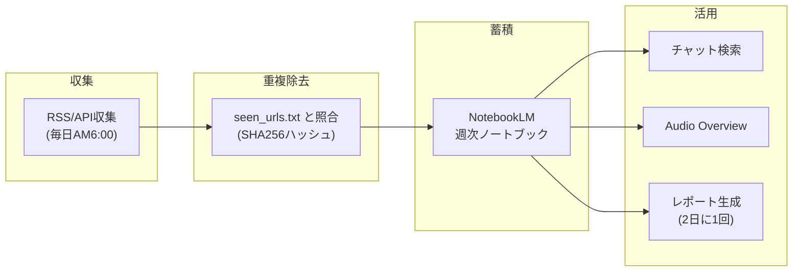
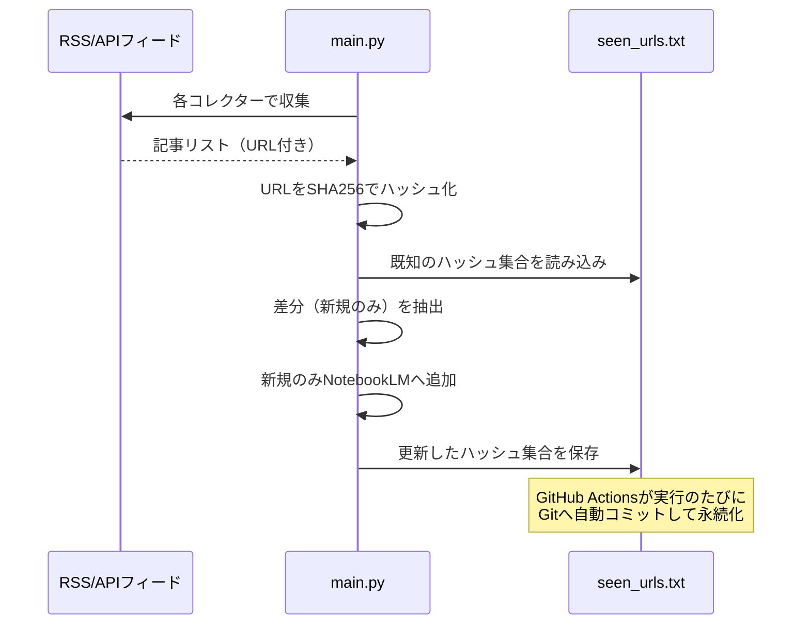
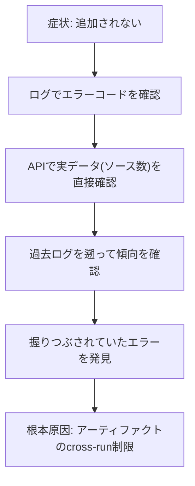

# GitHub Actions × NotebookLM 自動情報収集システム
## ハンズオン資料

> 作成者: 松浦真聖 (TK230178)
> 対象: エンジニア系学生
> 所要時間: 約45〜60分
> 最終更新: 2026-07-11

---

## はじめに

このハンズオンでは、技術記事・CEDEC資料・論文を毎日自動収集してNotebookLMに蓄積するシステムを構築します。一度セットアップすれば、人手を介さずに動き続けます。

**このシステムで実現できること**

- Zenn/Qiita/Unity/UE/CEDECの新着記事を毎日自動収集
- 卒論テーマに関連する論文を週2回自動収集
- NotebookLMに蓄積してAI検索・ポッドキャスト生成が使える
- レポートを2日に1回自動生成
- 認証切れ・容量超過・収集失敗を自動で検知して通知・自己修復

**このハンズオンで学べること**（技術トピック）

- GitHub Actionsのscheduleトリガーの使い方と制約
- 非公式APIライブラリ（ブラウザCookieベース認証）の扱い方
- 冪等性を意識した重複除去設計と、「動いているように見えて実は壊れている」バグの見つけ方
- 障害を検知→通知→自己修復するパイプラインの作り方

---

## 必要なもの

| 必要なもの | 補足 |
|---|---|
| GitHubアカウント | privateリポジトリを作成する |
| Googleアカウント | NotebookLM Plusが必要（月額約2,400円） |
| Python 3.11以上 | Windows環境でOK |
| GitHub CLI（`gh`） | https://cli.github.com/ |

> **WSL2は不要です。** 旧版の資料ではLinux環境でのログインを必須としていましたが、NotebookLMの認証Cookieの値自体はOSに依存しないため、Windows上で取得したCookieをそのままGitHub Actions（Linux）で使えます。

---

## ハンズオン手順

### Step 0: リポジトリのクローン

```powershell
git clone https://github.com/あなたのユーザー名/research-collector.git
cd research-collector
```

### Step 1: 依存ライブラリのインストール

```powershell
pip install feedparser requests python-dotenv
pip install "notebooklm-py[browser]==0.7.3"
playwright install chromium
```

> バージョンを`==0.7.3`で固定しているのには理由があります。詳しくは [コラム: なぜバージョン固定が重要か](#コラム-なぜバージョン固定が重要か) を参照してください。

### Step 2: NotebookLMへのログイン

```powershell
notebooklm login
# ブラウザが開いたらGoogleにログインしてENTERを押す
notebooklm create "Weekly-Digest"
# 表示されたIDをメモしておく
```

ログインが成功すると `~/.notebooklm/profiles/default/storage_state.json` が生成されます（0.7.3からプロファイル形式のパスに変わりました）。

### Step 3: GitHub Secretsの登録

```powershell
$json = (Get-Content "$env:USERPROFILE\.notebooklm\profiles\default\storage_state.json" -Raw |
  ConvertFrom-Json | ConvertTo-Json -Compress -Depth 10)
$json | gh secret set NOTEBOOKLM_AUTH_JSON --repo あなたのユーザー名/リポジトリ名
```

| Secret名 | 内容 |
|---|---|
| `NOTEBOOKLM_AUTH_JSON` | 上記コマンドで登録 |
| `NOTEBOOKLM_WEEKLY_DIGEST_ID` | Step 2でメモしたID |
| `ANTHROPIC_API_KEY` | https://console.anthropic.com で取得 |

**もう一つSecretが必要です。** セッションを15分おきに自動更新する仕組み（`auth_keepalive.yml`）がSecret自体を書き換えるため、専用の権限を持つトークンが必要です。

```
https://github.com/settings/personal-access-tokens/new を開く
→ Repository access: 対象リポジトリのみ選択
→ Permissions → Repository permissions → Secrets: Read and write
→ トークンを発行してコピー
```

```powershell
Get-Clipboard | gh secret set GH_PAT_SECRETS_WRITE --repo あなたのユーザー名/リポジトリ名
```

> なぜ`GITHUB_TOKEN`（既定のトークン）ではダメなのか？ GitHub Actionsの既定トークンには、意図的に「Secretsを書き換える権限」が含まれていません（自分自身の認証情報を自分で書き換えられると、ワークフロー経由でリポジトリの機密情報を盗み出す攻撃に悪用できてしまうためです）。だからこそ、スコープを絞った専用トークンを別途用意する設計になっています。

### Step 4: ラベル作成・Workflow permissions

```
/labels → New label で以下を作成: auth-expired, refresh-soon, weekly-digest-failed

Settings → Actions → General → Workflow permissions
→ Read and write permissions → Save
```

### Step 5: ローカルで動作確認

```powershell
python main.py --mode check   # 認証確認
python main.py --mode daily   # 収集テスト
```

出力例：
```
2026-07-11 04:20:13 [INFO] === Daily Collect Start ===
2026-07-11 04:20:13 [INFO] [NotebookLM] auth OK (32 notebooks)
2026-07-11 04:20:20 [INFO] Zenn/Qiita: 46 articles
2026-07-11 04:20:21 [INFO] Unity/UE: 10 articles
2026-07-11 04:20:21 [INFO] CEDEC: 25 items
2026-07-11 04:20:21 [INFO] Papers: skipped (runs Mon/Thu only)
2026-07-11 04:20:21 [INFO] Total collected: 81
2026-07-11 04:20:21 [INFO] [seen_urls] 81 new, 0 already seen
2026-07-11 04:20:53 [INFO] NotebookLM: ok=162, skip=0, errors=0
2026-07-11 04:20:53 [INFO] [seen_urls] saved 81 hashes
2026-07-11 04:20:53 [INFO] === Daily Collect Done ===
```

### Step 6: GitHubにpushして自動実行を有効化

```powershell
git add .
git commit -m "initial setup"
git push origin main
```

`Actions`タブ → `Daily Research Collect` → `Run workflow`で手動実行してテスト。

### Step 7: 認証の自動更新を有効化

```powershell
.\register_task.ps1
```

毎日AM5:30に認証更新を試みるタスクスケジューラを登録します（15分おきの`auth_keepalive.yml`と合わせた二段構えの保険です）。

---

## システムの全体像



### 重複チェックの仕組み

同じ記事を毎日追加しないように`seen_urls.txt`でURLを管理しています。



**重要な設計判断**: この`seen_urls.txt`は必ず**Gitにコミットして永続化**してください。GitHub Actionsの一時ファイル領域やアーティファクト機能に頼ると、後述するインシデントのような「動いているように見えて実は毎回リセットされている」問題が起きます。

---

## コラム: なぜバージョン固定が重要か

`requirements.txt`で`notebooklm-py[browser]==0.7.3`のように**厳密に**バージョンを固定しています。これは単なる慣習ではなく、実際に踏んだ問題に基づく判断です。

非公式ライブラリ（Web UIの内部通信を模倣するタイプ）は、対象サービス（今回はNotebookLM）側の仕様変更に応じて頻繁に破壊的変更が入ります。実際、このプロジェクトでは`0.3.4`→`0.7.3`の間に以下のような変更がありました。

- 認証ファイルの保存先が `~/.notebooklm/storage_state.json` から `~/.notebooklm/profiles/<profile>/storage_state.json` に変更
- 必須Cookieの定義に`__Secure-1PSIDTS`が追加
- `auth refresh`という新しいセッション維持コマンドが追加

もしローカル環境とCI環境でバージョンがズレていると、片方でしか通らない挙動の違いに気づかず長期間トラブルシューティングすることになります。**「pinしていないから常に最新が入る」は落とし穴になり得る**、という教訓です。

---

## コラム: 「動いているように見えるバグ」の見つけ方

2026-07-11に発覚したインシデントを教材として紹介します。

**症状**: 記事は収集できているのに、NotebookLMに追加されない。

**最初の仮説**: NotebookLM側の容量制限か、API側のエラーかもしれない。

**実際に確認したこと**:
1. ログを見ると`RPCError rpc_code=9`（FAILED_PRECONDITION）が出ていた → 「前提条件を満たしていない」ヒント
2. NotebookLM APIで各ノートブックの`sources_count`を直接確認 → 直近5週分が**ちょうど300件**（上限）で揃っていた。「ちょうど上限」は偶然ではなくシステム側の挙動を疑うサイン
3. ログをさかのぼると、毎日「新規X件、既読0件」ばかりで**一度も既読判定が出ていなかった**
4. `download-artifact`のログに`Artifact not found`のエラーが毎回出ていた（エラーが出ていても`continue-on-error: true`で握りつぶされ、失敗に気づきにくくなっていた）



**教訓**:
- **エラーコードは無視しない**。`rpc_code=9`のような一見わかりにくい番号でも、ドキュメントや慣習的な意味（gRPCのステータスコード体系）を調べると手がかりになる
- **「たまたまキリのいい数字」は疑う**。ちょうど上限値ぴったりというのは、ランダムな失敗ではなくロジックの結果であることが多い
- **`continue-on-error: true`は諸刃の剣**。ワークフローを止めないための保険として便利だが、本当は毎回失敗しているステップを見えなくしてしまう副作用がある。ログには残るので定期的に確認する習慣が大事
- **「新規/既読」のような集計値の履歴を追う**。1回のログだけでなく、過去のログを横断的に見ると「ずっと0だった」という異常に気づける

---

## NotebookLMの活用方法

### 週次ノートブックでチャット

```
Game-Dev-Tech-2026-W28 を開いて…

Q: 今週のUnityの注目アップデートを教えて
Q: DirectX12に関する記事をまとめて
```

### Audio Overviewで耳から学ぶ

ノートブックを開いて「Audio Overview」を生成すると、2人のAIが対談するポッドキャスト形式の音声が生成されます。

### レポートの確認

2日に1回自動生成されます。Actionsの`Artifacts`からMarkdownファイルをダウンロードして確認できます。

---

## 応用アイデア

### ① 卒論テーマに合わせてカスタマイズ

```python
# collectors/paper_collector.py
ARXIV_QUERIES = [
    "retrieval augmented generation DCC tools",
    "LLM tutorial generation Houdini",
]
```

### ② 就活ターゲット企業の情報を追加

```python
# collectors/zenn_qiita_collector.py に追加
COMPANY_FEEDS = [
    ("https://tech.なんとか会社.co.jp/feed", "unity", "company_blog"),
]
```

---

## セキュリティ上の注意

| ルール | 理由 |
|---|---|
| リポジトリは必ず`private`に設定 | Cookieや収集URLが外部に漏れるのを防ぐ |
| `.gitignore`に`storage_state.json`を追加済み | Google認証情報の漏洩防止 |
| `NOTEBOOKLM_AUTH_JSON`はGitHub Secretsのみで管理 | コード内にべた書きしない |
| `GH_PAT_SECRETS_WRITE`は権限を最小限（Secrets書き込みのみ）に絞る | 万一漏洩した際の被害範囲を限定するため |

---

## トラブルシューティング

### Q: auth FAILEDが出る

```powershell
.\refresh_auth.ps1
```

### Q: `All articles already seen.` と表示される

正常動作です。前回と同じ記事しか収集されなかった場合に表示されます。

### Q: NotebookLMへの追加でerrorが大量に出る

対象ノートブックが300件の上限に達している可能性があります。

```powershell
notebooklm source clean -n <ノートブックID> -y
```

### Q: `auth_keepalive`が頻繁に失敗する

GitHub Actions自体が高頻度cronを遅延させる仕様上の制約によるものです。毎日のタスクスケジューラとIssue通知でカバーされます。

---

## コマンドまとめ

```powershell
# ローカル実行
python main.py --mode check    # 認証確認
python main.py --mode daily    # デイリー収集
python main.py --mode weekly   # レポート生成

# notebooklm CLI
notebooklm list                       # ノートブック一覧
notebooklm login                      # 再ログイン
notebooklm auth refresh               # セッションローテーション
notebooklm doctor                     # 総合診断
notebooklm source clean -n <id> -y    # 重複ソース削除

# GitHub Actions手動実行
gh workflow run daily_collect.yml
gh workflow run auth_check.yml
```

---

## まとめ

一度セットアップすれば人手を介さず動き続けます。NotebookLMを外部脳として活用することで、大量の資料をAI検索できます。収集ソースとキーワードを変えれば自分のテーマに完全カスタマイズ可能です。

このハンズオンで紹介した「動いているように見えるバグ」の見つけ方は、このプロジェクトに限らず非同期・自動化システム全般に応用できる考え方です。ログを信じすぎず、実データと突き合わせる習慣を持ちましょう。

---

*GitHubリポジトリ: `manato1201/Research-Collector`（private）*
